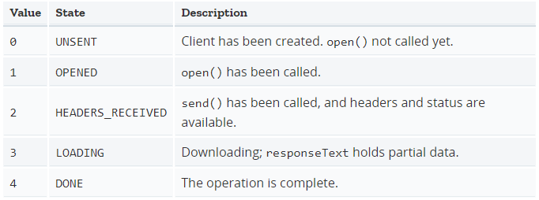

# Ajax

> 2020.03.05 @wsl

Ajax 即“Asynchronous Javascript And XML”（异步 JavaScript 和 XML），是指一种创建交互式、快速动态网页应用的网页开发技术，无需重新加载整个网页的情况下，能够更新部分网页的技术。

通过在后台与服务器进行少量数据交换，Ajax 可以使网页实现异步更新。这意味着可以在不重新加载整个网页的情况下，对网页的某部分进行更新。

## 1 发送HTTP请求

在现代浏览器上写AJAX主要依靠**XMLHttpRequest对象**。对于低版本的IE，需要换一个**ActiveXObject对象**。

通过检测window对象是否有XMLHttpRequest属性来确定浏览器是否支持标准的XMLHttpRequest。

### 请求类型

通过 `XMLHttpRequest` 生成的请求可以有两种方式来获取数据，异步模式或同步模式。请求的类型是由这个 `XMLHttpRequest` 对象的 [open()](https://developer.mozilla.org/zh-CN/docs/Web/API/XMLHttpRequest/open) 方法的第三个参数`async`的值决定的。如果该参数的值为 `false`，则该 `XMLHttpRequest`请求以同步模式进行，否则该过程将以异步模式完成。

### 发送请求&处理响应

当创建了XMLHttpRequest对象后，要先设置**onreadystatechange的回调函数**。在回调函数中，通常我们只需通过readyState === 4判断请求是否完成，如果已完成，再根据status === 200判断是否是一个成功的响应。

XMLHttpRequest对象的**open()方法**有3个参数，第一个参数指定是GET还是POST，第二个参数指定URL地址，第三个参数指定是否使用异步，默认是true。

> 注意，千万不要把第三个参数指定为false，否则浏览器将停止响应，直到AJAX请求完成。如果这个请求耗时10秒，那么10秒内你会发现浏览器处于“假死”状态。

最后调用**send()方法**才真正发送请求。GET请求不需要参数，POST请求需要把body部分以字符串或者FormData对象传进去。

例子：

```javascript
function success(text) {
    var textarea = document.getElementById('test-response-text');
    textarea.value = text;
}

function fail(code) {
    var textarea = document.getElementById('test-response-text');
    textarea.value = 'Error code: ' + code;
}

var request = new XMLHttpRequest(); // 新建XMLHttpRequest对象

request.onreadystatechange = function () { // 状态发生变化时，函数被回调
    if (request.readyState === 4) { // 成功完成
        // 判断响应结果:
        if (request.status === 200) {
            // 成功，通过responseText拿到响应的文本:
            return success(request.responseText);
        } else {
            // 失败，根据响应码判断失败原因:
            return fail(request.status);
        }
    } else {
        // HTTP请求还在继续...
    }
}

// 发送请求:
request.open('GET', '/api/categories');
request.send();
```


## 2 安全限制

默认情况下，浏览器遵循**同源策略**，JavaScript在发送AJAX请求时，URL的域名必须和当前页面完全一致。

>  完全一致的意思是，域名要相同（www.example.com和example.com不同），协议要相同（http和https不同），端口号要相同（默认是:80端口，它和:8080就不同）。有的浏览器宽松一点，允许端口不同，大多数浏览器都会严格遵守这个限制。

跨域的方式：

1. 通过Flash插件发送HTTP请求

2. 配置代理服务器，如Nginx

3. JSONP跨域

   只能用GET请求，并且要求返回JavaScript。JSONP通常以函数调用的形式返回。

4. CORS

   如果浏览器支持HTML5，那么就可以一劳永逸地使用新的跨域策略：CORS了。

   CORS全称Cross-Origin Resource Sharing，是HTML5规范定义的如何跨域访问资源。

   Origin表示本域，也就是浏览器当前页面的域。当JavaScript向外域（如sina.com）发起请求后，浏览器收到响应后，首先检查Access-Control-Allow-Origin是否包含本域，如果是，则此次跨域请求成功，如果不是，则请求失败，JavaScript将无法获取到响应的任何数据。

   对于PUT、DELETE以及其他类型如application/json的POST请求，在发送AJAX请求之前，浏览器会先发送一个OPTIONS请求（称为preflighted请求）到这个URL上，询问目标服务器是否接受；服务器必须响应并明确指出允许的Method；浏览器确认服务器响应的Access-Control-Allow-Methods头确实包含将要发送的AJAX请求的Method，才会继续发送AJAX，否则，抛出一个错误。

 

## 3 XMLHttpRequest

使用 `XMLHttpRequest`（XHR）对象可以与服务器交互。您可以从URL获取数据，而无需让整个的页面刷新。这允许网页在不影响用户的操作的情况下更新页面的局部内容。

尽管名称如此，`XMLHttpRequest` 可以用于获取任何类型的数据，而不仅仅是XML，它甚至支持 [HTTP](https://developer.mozilla.org/en-US/docs/Web/HTTP) 以外的协议（包括 file:// 和 FTP）。

### 3.1 Constructor

XMLHttpRequest()

```javascript
var myRequest = new XMLHttpRequest();
```

### 3.2 Properties

只列了一部分，详见 <https://developer.mozilla.org/zh-CN/docs/Web/API/XMLHttpRequest>。

#### XMLHttpRequest.onreadystatechange

当 readyState 属性发生变化时调用的 `EventHandler`。

#### XMLHttpRequest.readyState

> 只读

请求的五种状态：




```javascript
var xhr = new XMLHttpRequest();
console.log('UNSENT', xhr.readyState); // readyState will be 0

xhr.open('GET', '/api', true);
console.log('OPENED', xhr.readyState); // readyState will be 1

xhr.onprogress = function () {
    console.log('LOADING', xhr.readyState); // readyState will be 3
};

xhr.onload = function () {
    console.log('DONE', xhr.readyState); // readyState will be 4
};

xhr.send(null);
```

#### XMLHttpRequest.response

> 只读

包含整个响应实体（response body），响应实体的类型由 responseType 来指定， 可以是 ArrayBuffer， Blob， Document， JavaScript 对象 (即 "json")， 或者是字符串。如果请求未完成或失败，则该值为 null。

#### XMLHttpRequest.responseType

设置该值能够改变响应类型。就是告诉服务器你期望的响应格式。

#### XMLHttpRequest.status

> 只读

该请求的响应状态码 (例如, 状态码200 表示一个成功的请求)。

#### XMLHttpRequest.timeout
一个无符号长整型（unsigned long）数字，表示该请求的最大请求时间（毫秒），若超出该时间，则请求会自动结束。

#### XMLHttpRequestEventTarget.ontimeout
当请求超时调用的 EventHandler。

#### XMLHttpRequest.withCredentials

一个布尔值，表明在进行跨站(cross-site)的访问控制(Access-Control)请求时，是否使用认证信息(例如cookie或授权的header)。 默认为 false。

 #### 事件处理

作为 `XMLHttpRequest` 实例的属性，所有浏览器都支持 `onreadystatechange`。

后来，许多浏览器实现了一些额外的事件（`onload`、`onerror`、`onprogress` 等）。详见[Using XMLHttpRequest](https://developer.mozilla.org/zh-CN/docs/Web/API/XMLHttpRequest/Using_XMLHttpRequest)。

更多现代浏览器，包括 Firefox，除了可以设置 `on*` 属性外，也提供标准监听器 [`addEventListener()`](https://developer.mozilla.org/zh-CN/docs/Web/API/EventTarget/addEventListener) API 来监听`XMLHttpRequest` 事件。

### 3.3 Methods

部分方法，详见只列了一部分，详见 <https://developer.mozilla.org/zh-CN/docs/Web/API/XMLHttpRequest>。

#### XMLHttpRequest.abort()

如果请求已被发送，则立刻中止请求。

#### XMLHttpRequest.open()

初始化一个请求。该方法只能在 JavaScript 代码中使用，若要在 native code 中初始化请求，请使用 [`openRequest()`](https://developer.mozilla.org/zh-CN/docs/Mozilla/Tech/XPCOM/Reference/Interface/nsIXMLHttpRequest)。

```javascript
void open(
   DOMString method,
   DOMString url,
   optional boolean async,
   optional DOMString user,
   optional DOMString password
);
```

参数：

- **method**

  请求所使用的HTTP方法；例如 "GET"、"POST"、"PUT"、"DELETE"等。如果下个参数是非HTTP(S)的URL，则忽略该参数。

- **url**

  该请求所要访问的URL

- **async**

  一个可选的布尔参数，默认为`true`，表示要不要异步执行操作。如果值为`false`，`send()`方法直到收到答复前不会返回。如果`true`，已完成事务的通知可供事件监听器使用。

  如果`multipart`属性为`true`则这个必须为`true`，否则将引发异常。

- **user**

  用户名，可选参数，为授权使用；默认参数为空string。

- **password**

  密码，可选参数，为授权使用；默认参数为空string。

#### XMLHttpRequest.send()

发送请求。如果请求是异步的（默认），那么该方法将在请求发送后立即返回。


## 参考链接

[廖雪峰 AJAX](https://www.liaoxuefeng.com/wiki/001434446689867b27157e896e74d51a89c25cc8b43bdb3000/001434499861493e7c35be5e0864769a2c06afb4754acc6000)

[MDN | XMLHttpRequest](https://developer.mozilla.org/zh-CN/docs/Web/API/XMLHttpRequest)

[MDN|使用XMLHttpRequest](https://developer.mozilla.org/zh-CN/docs/Web/API/XMLHttpRequest/Using_XMLHttpRequest)

[JavaScript数据传输总结](https://sunpeijun.github.io/posts/html/20160716-JavaScript数据传输.html)

[原生JS写Ajax的请求函数-原生ajax](http://caibaojian.com/ajax-jsonp.html)