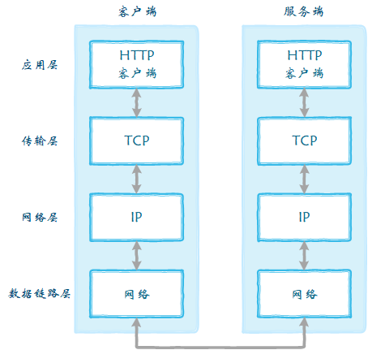

# 从url到页面渲染完成

> 2020.03.31 @wsl

域名解析-TCP分包-IP寻路-握手-滑动窗口传输-持久化连接-挥手-解析-构建dom树与cssom-构建渲染树-回流-重绘-渲染

总的来说，分为以下几个过程：

- 输入URL
- DNS解析
- TCP握手
- HTTP请求与响应
- 浏览器解析渲染页面
- 连接结束

## 输入URL

> URL（uniform resource locator）中文名叫做统一资源定位符，统一资源定位符是对可以从互联网上得到的资源的位置和访问方法的一种简洁的表示，是互联网上标准资源的地址。互联网上的每个文件都有一个唯一的URL，它包含的信息指出文件的位置以及浏览器应该怎么处理它。

**主要组成部分：`protocol :// hostname[:port] / path / [;parameters][?query]#fragment`**

- protocol（协议）
- hostname（主机名）
- port（端口号）
- path（路径）
- parameters（参数）
- query(查询)
- fragment（信息片断）

## DNS解析

> DNS域名系统（Domain Name System）是互联网的一项服务。它作为将域名和IP地址相互映射的一个分布式数据库，能够使人更方便地访问互联网。DNS使用TCP和UDP端口53。当前，对于每一级域名长度的限制是63个字符，域名总长度则不能超过253个字符。

> DNS解析的过程就是寻找哪台机器上有你需要资源的过程。当你在浏览器中输入一个地址时，例如<www.baidu.com>，其实不是百度网站真正意义上的地址。互联网上每一台计算机的唯一标识是它的IP地址，但是IP地址并不方便记忆。用户更喜欢用方便记忆的网址去寻找互联网上的其它计算机，也就是上面提到的百度的网址。所以互联网设计者需要在用户的方便性与可用性方面做一个权衡，这个权衡就是一个网址到IP地址的转换，这个过程就是DNS解析。它实际上充当了一个翻译的角色，实现了网址到IP地址的转换。

DNS 在解析域名的时候有两种方式：**递归查询和迭代查询**

### 递归查询

浏览器缓存 -> 操作系统缓存 -> 本地hosts文件 -> 路由器缓存 -> ISP DNS缓存 -> 根DNS服务器

#### 流程

1、**浏览器缓存** 

首先会向浏览器的缓存中读取上一次访问的记录，在chrome可以通过地址栏中输入chrome://net-internals/#dns查看缓存的当前状态 。

2、**操作系统缓存**

查找存储在系统运行内存中的缓存。

3、 **hosts 文件**

查看本地硬盘的 hosts 文件，看看其中有没有和这个域名对应的规则，如果有的话就直接使用 hosts 文件里面的 ip 地址。

> 注意这个地方存在安全隐患，如果有病毒把一些常用的域名，修改 hosts 文件，指向一些恶意的IP，那么浏览器也会不加判断的去连接。

4、**路由器缓存**

有些路由器也有DNS缓存的功能，访问过的域名会存在路由器上。

5、**ISP DNS缓存**

本地名称服务器缓存，就是客户端电脑TCP/IP参数中设置的首选DNS服务器，此解析具有权威性。

ISP（Internet Service Provider，互联网服务提供商）（如中国电信）提供的DNS服务，比如比较著名的 114.114.114.114，在本地查找不到的情况下，就会向ISP进行查询，ISP会在当前服务器的缓存内查找是否有记录，如果有，则返回这个IP，若没有，这时候会根据本地DNS服务器的设置（是否设置转发器）进行查询，如果未用转发模式，则本地名称服务器再以DNS客户端的角色发送与前面一样的DNS域名查询请求转发给上一层。这里可能经过一次或者多次转发，从**本地名称服务器**到**权威名称服务器**再到**顶级名称服务器**最后到**根名称服务器**。

6、**顶级DNS服务器/根DNS服务器**

根域名收到请求后，会判别这个域名(.com)是授权给哪台服务器管理,并返回这个顶级DNS服务器的IP。请求者收到这台顶级DNS的服务器IP后，会向该服务器发起查询，如果该服务器无法解析，该服务器就会返回下一级的DNS服务器IP（nicefilm.com），本机继续查找，直到服务器找到(www.nicefilm.com)的主机。

如果顶级DNS服务器也找不到对应的域名记录，则会向本地名称服务器返回一条查询失败的DNS应答报文，这条报文最终也会由本地名称服务器返回给DNS客户端。

本地DNS服务器向域名的解析服务器发出请求，如果查询成功，会收到一个域名和IP地址对应关系，本地DNS服务器不仅要把IP地址返回给用户电脑，还要把这个对应关系保存在缓存中，以备下次别的用户查询时，可以直接返回结果，加快网络访问。

#### 总结

可以看到DNS的域名解析是递归的，递归的DNS首先会查看自己的DNS缓存，如果缓存能够命中，那么就从缓存中把IP地址返回给浏览器，如果找不到对应的域名的IP地址，那么就依此层层向上转发请求，从根域名服务器到顶级域名服务器再到极限域名服务器依次搜索对应目标域名的IP，最高达到根节点，找到或者全部找不到为止。

然后把找到的这个域名对应的 nameserver 的地址拿到，再向这个 namserver 去请求域名对应的IP，最后把这个IP地址返回给浏览器，在这个**递归查询**的过程中，对于浏览器来说是透明的，如果DNS客户端的本地名称服务器不能解析的话，则后面的查询都会以本地名称服务器为中心，全交由本地名称服务器代替DNS客户端进行查询，DNS客户端只是发出原始的域名查询请求报文，然后就一直处于等待状态，直到本地名称服务器最终从权威名称服务器得到了正确的IP地址查询结果并返回给它。

### 迭代查询

递归查询是默认的DNS查询方式，但是如果有以下情况发生的话，则会使用迭代的查询方式进行。

- 情况一：DNS客户端的请求报文中没有申请使用递归查询，即在DNS请求报头部的RD字段没有置1。

- 情况二：DNS客户端的请求报文中申请使用的是递归查询（也就是RD字段置1了），但在所配置的本地名称服务器上是禁用递归查询了（即在应答DNS报文头部的RA字段置0）。

#### 流程

1、**查询缓存**

开始也是从浏览器缓存到系统缓存到路由缓存，如果还是没找到则客户端向本机配置的本地名称服务器（在此仅以首先DNS服务器为例进行介绍，其它备用DNS服务器的解析流程完全一样）发出DNS域名查询请求。

2、**本地名称服务器**

本地名称服务器收到请求后，先查询本地的缓存，如果有该域名的记录项，则本地名称服务器就直接把查询的结果返回给客户端；如果本地缓存中没有该域名的记录，则向DNS客户端返回一条DNS应答报文，报文中会给出一些参考信息，如本地名称服务器上的根名称服务器地址等。

3、**根名称服务器**

DNS客户端在收到本地名称服务器的应答报文后，会根据其中的根名称服务器地址信息，向对应的根名称服务器再次发出与前面一样的DNS查询请求报文。根名称服务器在收到DNS查询请求报文后，通过查询自己的DNS数据库得到请求DNS域名中顶级域名所对应的顶级名称服务器信息，然后以一条DNS应答报文返回给DNS客户端。

4、**顶级名称服务器**

DNS客户端根据来自根名称服务器应答报文中的对应顶级名称服务器地址信息，向该顶级名称服务器发出与前面一样的DNS查询请求报文。顶级名称服务器在收到DNS查询请求后，先查询自己的缓存，如果有请求的DNS域名的记录项，则直接把对应的记录项返回给DNS客户端，否则通过查询后把对应域名中二级域名所对应的二级名称服务器地址信息以一条DNS应答报文返回给DNS客户端。

5、**向下逐级查询**

然后DNS客户端继续按照前面介绍的方法一次次地向三级、四级名称服务器查询，直到最终的权威名称服务器返回到最终的记录。如果权威名称服务器也找不到对应的域名记录，则会向DNS客户端返回一条查询失败的DNS应答报文。当然，如果这个权威名称服务器上配置了指向其它名称服务器的转发器，则权威名称服务器还会在转发器指向的名称服务器上进一步查询。另外，如果DNS客户端上配置了多个DNS服务器，则还会继续向其它DNS服务器查询。

#### 总结

我们发现在递归查询中后面的查询工作是由本地名称服务器替代DNS客户端进行的（以“本地名称服务器”为中心），只需要本地名称服务器向DNS客户端返回最终的查询结果即可。而DNS迭代查询的所有查询工作则全部是DNS客户端自己进行（以“DNS客户端”自己为中心）。

### DNS优化

1、**DNS缓存**

为了减少查询的次数，DNS存在着多级缓存，有以下几种：浏览器缓存，系统缓存，路由器缓存，ISP服务器缓存，根域名服务器缓存，顶级域名服务器缓存，主域名服务器缓存。

- 在chrome浏览器中输入:chrome://dns/，可以看到chrome浏览器的DNS缓存。
- 系统缓存主要存在/etc/hosts(Linux系统)中

2、**DNS负载均衡**

当一个网站有足够多的用户的时候，假如每次请求的资源都位于同一台机器上面，那么这台机器随时可能会崩掉。处理办法就是用DNS负载均衡技术，它的原理是在DNS服务器中为同一个主机名配置多个IP地址，在应答DNS查询时，DNS服务器对每个查询将以DNS文件中主机记录的IP地址按顺序返回不同的解析结果，将客户端的访问引导到不同的机器上去，使得不同的客户端访问不同的服务器，从而达到负载均衡的目的。例如可以根据每台机器的负载量，该机器离用户地理位置的距离等等。

## TCP 握手

互联网内各网络设备间的通信都遵循TCP/IP协议，利用TCP/IP协议族进行网络通信时，会通过分层顺序与对方进行通信。分层由高到低分别为：应用层、传输层、网络层、数据链路层。发送端从应用层往下走，接收端从数据链路层网上走。如图所示：

从上面的步骤中得到 IP 地址后，浏览器会开始构造一个 HTTP 请求，应用层客户端向服务器端发送的HTTP请求包括：请求报头和请求主体两个部分，其中请求报头（request header）包含了至关重要的信息，包括请求的方法（GET / POST和不常用的PUT / DELETE以及更不常用的HEAD / OPTION / TRACE，一般的浏览器只能发起 GET 或者 POST 请求）、目标url、遵循的协议（HTTP / HTTPS / FTP…），返回的信息是否需要缓存，以及客户端是否发送Cookie等信息。需要注意的是，因为 HTTP 请求是纯文本格式的，所以在 TCP 的数据段中可以直接分析 HTTP 文本的。

## 参考链接

[前端经典面试题: 从输入URL到页面加载发生了什么？ - segmentfault](https://segmentfault.com/a/1190000006879700)

[从输入URL 到页面加载完成的过程中都发生了什么- 知乎](https://zhuanlan.zhihu.com/p/23155051)

[浏览器工作原理：从URL 输入到页面展现到底发生了什么？ - 简书](https://www.jianshu.com/p/d616d887953a)

[从输入URL到页面展示，你想知道些什么？ - 掘金](https://juejin.im/post/5b148a2ce51d4506965908d2)