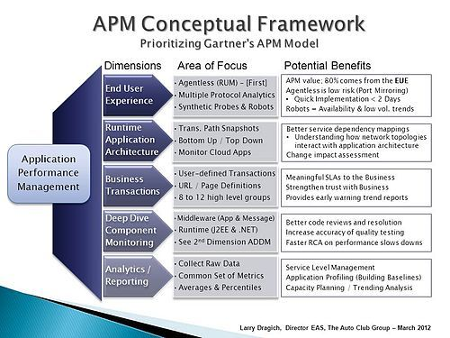

# Elastic APM

## 什么是APM

### 可观察性

> “可观察性”不是供应商能够在系统之外单独交付的功能，而是您在构建系统时植根于其中的一个属性，就像易用性、高可用性和稳定性一样。设计和构建“可观察”系统的目标在于，确保当它在生产中运行时，负责操作它的人员能够**检测到不良行为**（例如，服务停机、错误、响应缓慢），并拥有可操作的信息以**有效地确定根本原因**（例如，详细的事件日志、细粒度的资源使用信息，以及应用程序跟踪）。

打造可观察性的系统包括三个要素：


- 日志：程序运行产生的事件，可以详细解释其运行状态； 
- 指标：一组聚合数值，主要用于监控基础设施（机器、容器、网络等），但也有应用会用于监控业务层面，比如开源搜索系统Elasticsearch就有关于查询或写入量、耗时、拒绝率等应用层面的指标；
- 应用性能监控（Application Performance Monitor）：深入到代码层面的追踪（或监控），包括程序内部执行过程、服务之间链路调用等情况，能轻易的找到程序“慢”的原因。

### APM

应用性能监控（Application Performance Monitoring，APM），是对应用程序性能和可用性的监视和管理。 APM努力检测和诊断复杂的应用程序性能问题，以维持预期的服务等级。

> APM 在维基百科上的定义是[应用性能管理（Application Performance Management）](https://en.wikipedia.org/wiki/Application_performance_management#The_APM_conceptual_framework)，而市面上大多数APM产品定义则是应用性能监控（Application Performance Monitoring）。[《What Is Application Performance Monitoring and Why It Is Not Application Performance Management》](https://stackify.com/what-is-application-performance-monitoring/) 此文认为应用性能监控是应用性能管理一部分，前者能帮你找到问题，而后者能帮你分析并解决问题。但实际上大部分APM产品都包含了分析问题的部分，并且业界也没有对两个定义作出明确的区分，所以基本上我们可以将两者视为是相同的。



- 最终用户体验监控（End user experience monitoring）。通过监控用户的行为以期优化用户体验。比如：监控用户和web界面/客户端的交互，并记录交互事件的时间。
- 运行时应用程序架构（Runtime application architecture）。理解服务间的依赖关系、架构中应用程序交互的网络拓扑。
- 业务事务（Business transaction）。产生有意义的SLA报告，并从业务角度提供有关应用程序性能的趋势信息。
- 深入组件监控（Deep dive component monitoring）。通常需要安装agent并且主要针对中间层，包括web服务器、应用和消息服务器等。健壮的监控应该能显示代码执行的清晰路径，因为这一维度和上述第二个维度紧密相关，APM产品通常会将这两个维度合并作为一个功能。
- 分析或报告（Analytics/reporting）。将从应用程序中收集的一系列指标数据，标准化的展现成应用性能数据的通用视图。

> SLA：Service Level Agreement，服务级别协议，是服务提供商与客户之间定义的正式承诺。服务提供商与受服务用户之间具体达成了承诺的服务指标——质量、可用性，责任。
>
> 参见：[维基百科|服务级别协议](https://zh.wikipedia.org/wiki/服务级别协议)

## Elastic APM

### Elastic APM与SkyWalking的对比

|                           | Elastic APM                                                  | SkyWalking                                                   |
| :------------------------ | :----------------------------------------------------------- | ------------------------------------------------------------ |
| 支持语言                  | Java, .NET, Node.js, Python, Ruby, Javascript, Go            | Java, .NET Core, NodeJS, PHP and Go                          |
| 是否支持tracing           | 是                                                           | 是                                                           |
| 支持存储                  | Elasticsearch                                                | ElasticSearch, H2, MySQL                                     |
| UI丰富度                  | 高。相比后者能在UI中进行复杂的查询和过滤                     | 高。相比前者有服务间的拓扑图                                 |
| Agent易用性（代码侵入性） | Java, .NET Core、Node.js 部分开源库无需侵入代码自动装配（instrument），Python, Ruby, Javascript, Go 部分开源库提供SDK手动装配。而对于不支持的库/框架，也能通过Public API采集。 | Java, .NET Core, NodeJS 部分开源库无需侵入代码自动装配，不支持的无法使用；Go和PHP提供SDK手动装配。 |
| 查询能力                  | 能在Kibana APM UI对任意APM信息进行查询或过滤                 | 仅支持TraceId、endpoint name查询                             |
| 告警                      | 支持                                                         | 支持                                                         |
| JVM 监控                  | 支持                                                         | 支持                                                         |
| Go Runtime监控            | 支持                                                         | 不支持                                                       |
| 收集错误和异常            | 支持                                                         | 不支持                                                       |
| 实现全面可观察性          | 支持。在Elastic Stack中你已经可以拥有日志及指标的完备解决方案，再结合APM，就可以实现全面的可观察性系统。 | 不支持                                                       |

### 简介

Elastic APM 是基于 Elastic Stack 构建的应用性能监控系统。功能如下：

- 实时的监控软件服务和应用：收集有关请求的响应时间、数据库查询、高速缓存调用、外部 HTTP 请求等的详细性能信息，这样可以更快地查明并修复性能问题。
- 错误监控：自动收集未处理的错和异常以及它们的调用栈，错误主要基于堆栈跟踪进行分组，让你能快速定位新错误并且跟踪错误出现的频率。
- 指标收集：收集机器级别以及特定agent的指标（比如Java JVM和Go Runtime的指标）。
- 分布式追踪：使你能够在一个视图中分析整个服务架构的性能。
- 真实用户监控（Real User Monitoring，RUM）：可捕获用户与客户端（例如Web浏览器）的交互。


### 基本组件

Elastic APM由四个组件组成：

- APM agents：以应用程序库的形式提供，收集程序中的性能监控数据并上报给APM server。
- APM Server：从APM agents接收数据、进行校验和处理后写入Elasticsearch特定的APM索引中。虽然agent也可以实现为：将数据收集处理后直接上报到ES，不这么做官方给出的理由：使agent保持轻量，防止某些安全风险以及提升Elastic组件的兼容性。
- Elasticsearch：用于存储性能指标数据并提供[聚合](https://www.elastic.co/guide/en/elasticsearch/reference/7.2/search-aggregations.html)功能。
- Kibana：可视化性能数据并帮助找到性能瓶颈。


### 数据模型

Elastic APM agent从其检测（[instrument](https://en.wikipedia.org/wiki/Instrumentation)）的应用程序中收集不同类型的数据，这些被称为事件，类型包括spans，transactions，errors和metrics四种。

- Span：包含有关已执行的特定代码路径的信息。它们从活动的开始到结束进行度量，并且可以与其他span具有父/子关系。
- 事务（Transaction） 是一种特殊的Span（没有父span，只能从中派生出子span，可以理解为“树”这种数据结构的根节点），具有与之关联的其他属性。可以将事务视为服务中最高级别的工作，比如服务中的请求等。
- 错误：错误事件包含有关发生的原始异常或有关发生异常时创建的日志的信息。
- 指标：APM agent自动获取基本的主机级别指标，包括系统和进程级别的CPU和内存指标。除此之外还可获取特定于代理的指标，例如Java agent中的JVM指标和Go代理中的Go运行时指标。


## 项目引入

### vue

安装 @elastic/apm-rum-vue 插件，在main.js里面初始化apm，在组件中可以使用apm实例。

参考：<https://www.elastic.co/guide/en/apm/agent/rum-js/master/vue-integration.html>

### egg

```bash
npm install elastic-apm-node --save
```

在app.js初始化apm。config 添加 usePathAsTransactionName: true，解决egg的path解析不了的问题。

参考：

<https://www.elastic.co/guide/en/apm/agent/nodejs/current/koa.html>

loader顺序：<https://eggjs.org/zh-cn/advanced/loader.html>

demo：<https://code.yeezon.com/zen/egg-apm>


## 自定义上报

### 错误捕获

```js
apm.captureError(error[, options][, callback])
```

参见：<https://www.elastic.co/guide/en/apm/agent/nodejs/master/agent-api.html#apm-capture-error>

#### egg自动捕获

在打印错误日志时进行捕获

```js
const { Transport } = require('egg-logger');

class ApmErrorTransport extends Transport {
    constructor(options, apm) {
        super(options);
        this.apm = apm;
    }

    log(_level, args) {
        if (!args[0]) {
            return;
        }
        this.apm.captureError(args[0]); // 上传到apm
    }
};

app.beforeStart(async () => {
    // 将APM实例挂载到application对象上面。可用于内部手动上报日志。
    app.apm = apm;
    // 设置错误日志的传输通道。所有logger.error的错误，都会发送到APM上面。
    app.getLogger('errorLogger').set('apmError', new ApmErrorTransport({ level: 'ERROR' }, apm));
});
```


### 自定义transactions

```js
// 开始一个新的transaction
var trans = apm.startTransaction(name, type, subtype, action, options);

// ...
callback((err) => {
    // 配置transaction的一些属性
    trans.result = err ? 'error' : 'success';
});

// 结束这个transaction，如果这个transaction已经结束，则无事发生
trans.end();
```

node端：

<https://www.elastic.co/guide/en/apm/agent/nodejs/master/custom-transactions.html>

<https://www.elastic.co/guide/en/apm/agent/nodejs/master/transaction-api.html>

rum端（前端）：

<https://www.elastic.co/guide/en/apm/agent/rum-js/master/custom-transactions.html>

<https://www.elastic.co/guide/en/apm/agent/rum-js/master/transaction-api.html>


### 自定义spans

```js
// 开始一个span
var span = apm.startSpan(name, type, subtype, action, options);

// ...

// 结束span
if (span) span.end();
```

node端：

<https://www.elastic.co/guide/en/apm/agent/nodejs/master/custom-spans.html>

<https://www.elastic.co/guide/en/apm/agent/nodejs/master/span-api.html>

rum端（前端）：

<https://www.elastic.co/guide/en/apm/agent/rum-js/master/agent-api.html#apm-start-span>

<https://www.elastic.co/guide/en/apm/agent/rum-js/master/span-api.html>


## 参考链接

[介绍](https://www.elastic.co/guide/en/apm/index.html)

<https://www.elastic.co/cn/apm>

[与Elastic APM 集成的问题· Issue #2706 · eggjs/egg · GitHub](https://github.com/eggjs/egg/issues/2706)

[elastic-apm-node 扩展篇—— Egg | Claude's Blog](http://claude-ray.com/2019/07/12/elastic-apm-node-egg/)

[最佳日志实践（v2.0）](https://zhuanlan.zhihu.com/p/27363484)

[[RFC] egg-opentracing](https://github.com/eggjs/egg/issues/39)

[如何更优雅的使用egg的日志体系？](https://github.com/eggjs/egg/issues/2006)

[史上最强egg框架的error处理机制_网络_process的博客-CSDN ...](https://blog.csdn.net/qq_33589252/article/details/84350064)

[elasticsearch APM功能全解 一](https://blog.csdn.net/u013613428/article/details/86667240)

[webpack config sourcemap](https://www.webpackjs.com/configuration/devtool/)

[javascript - 如何让webpack能够生成sourcemap，从而方便调试 ...](https://segmentfault.com/q/1010000008889633)

[使用Elastic APM做应用性能监控- 云+社区- 腾讯云](https://cloud.tencent.com/developer/article/1543781)

[ElasticAPM初体验- 掘金](https://juejin.im/post/5e15a07f6fb9a0484d690b5d)

[应用性能监控（APM）](https://juejin.im/post/5ba06f96f265da0ac84929e9)

[观察之道：带你走进可观察性](https://www.infoq.cn/article/observability-enhance)

[借助 Elastic Stack 实现可观察性](https://www.elastic.co/cn/blog/observability-with-the-elastic-stack)

[Elastic APM 介绍 - Elastic 中文社区](https://elasticsearch.cn/uploads/slides/20200420/549dbfd58e22ff2ef22da29128da21f7.pdf)

[利用 Elasticsearch 和 Elastic APM 监测应用](https://www.elastic.co/cn/blog/monitoring-applications-with-elasticsearch-and-elastic-apm)

[分布式跟踪、开放式跟踪和 Elastic APM](https://www.elastic.co/cn/blog/distributed-tracing-opentracing-and-elastic-apm)

[Elasticsearch 可观察性：采用 Prometheus 和 OpenMetrics…](https://www.elastic.co/cn/blog/elasticsearch-observability-embracing-prometheus-and-openmetrics-standards-for-metrics)

[Elastic RUM 浅谈](https://www.elastic.co/cn/blog/performing-real-user-monitoring-rum-with-elastic-apm)

[可观察性更新：APM 中的 .NET、Kubernetes 监测、Metrics Explorer](https://www.elastic.co/cn/blog/elastic-observability-update-7-2-0)

[如何从 Elastic APM 通过 Logstash 或 Kafka 发送数据](https://www.elastic.co/cn/blog/how-to-send-data-through-logstash-or-kafka-from-elastic-apm)

[You know, for search--带你认识Elasticsearch](https://zhuanlan.zhihu.com/p/96076150)

[APM系统SkyWalking介绍](https://juejin.im/post/5d2bd2dfe51d45773f2e8ff3)

