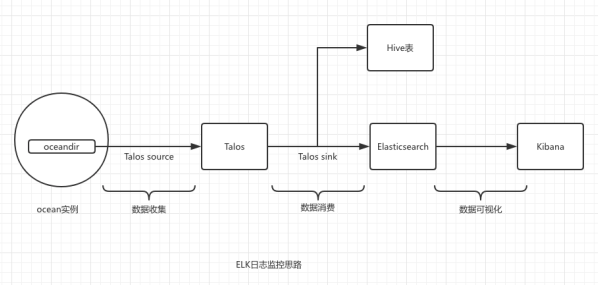

# ELK

ELK 是 ElasticSearch + Logstash + Kibana 这套组合工具的简称，是一个常用的日志系统。

- ElasticSearch：是一款开源的基于 Lucene 之上实现的一个分布式搜索引擎，也是一个存储引擎（例如：日志），它的特点有：分布式、零配置、自动发现、索引自动分片、索引副本机制、Restful 风格的接口、多数据源和自动搜索负载等。
- Logstash：是一款开源的日志收集工具，它可以对日志进行收集、分析、过滤，并将其存储（例如：ElasticSearch）起来供以后使用。
- Kibana：是一款开源的可视化工具，可以为 ElasticSearch 提供的日志分析友好的 Web 界面，可以汇总、分析和搜索重要的数据日志。

## 流程图

## 参考链接

[ELK](https://www.bookstack.cn/read/node-in-debugging/6.3ELK.md)

