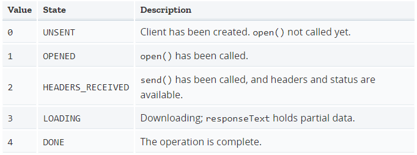

# Ajax

> 2020.03.05 @wsl

Ajax 即“Asynchronous Javascript And XML”（异步 JavaScript 和 XML），是指一种创建交互式、快速动态网页应用的网页开发技术，无需重新加载整个网页的情况下，能够更新部分网页的技术。

通过在后台与服务器进行少量数据交换，Ajax 可以使网页实现异步更新。这意味着可以在不重新加载整个网页的情况下，对网页的某部分进行更新。

## 1 发送HTTP请求

在现代浏览器上写AJAX主要依靠**XMLHttpRequest对象**。对于低版本的IE，需要换一个**ActiveXObject对象**。

通过检测window对象是否有XMLHttpRequest属性来确定浏览器是否支持标准的XMLHttpRequest。

### 请求类型

通过 `XMLHttpRequest` 生成的请求可以有两种方式来获取数据，异步模式或同步模式。请求的类型是由这个 `XMLHttpRequest` 对象的 [open()](https://developer.mozilla.org/zh-CN/docs/Web/API/XMLHttpRequest/open) 方法的第三个参数`async`的值决定的。如果该参数的值为 `false`，则该 `XMLHttpRequest`请求以同步模式进行，否则该过程将以异步模式完成。

### 发送请求&处理响应

当创建了XMLHttpRequest对象后，要先设置**onreadystatechange的回调函数**。在回调函数中，通常我们只需通过readyState === 4判断请求是否完成，如果已完成，再根据status === 200判断是否是一个成功的响应。

XMLHttpRequest对象的**open()方法**有3个参数，第一个参数指定是GET还是POST，第二个参数指定URL地址，第三个参数指定是否使用异步，默认是true，所以不用写。

> 注意，千万不要把第三个参数指定为false，否则浏览器将停止响应，直到AJAX请求完成。如果这个请求耗时10秒，那么10秒内你会发现浏览器处于“假死”状态。

最后调用**send()方法**才真正发送请求。GET请求不需要参数，POST请求需要把body部分以字符串或者FormData对象传进去。

例子：

```javascript
function success(text) {
    var textarea = document.getElementById('test-response-text');
    textarea.value = text;
}

function fail(code) {
    var textarea = document.getElementById('test-response-text');
    textarea.value = 'Error code: ' + code;
}

var request = new XMLHttpRequest(); // 新建XMLHttpRequest对象

request.onreadystatechange = function () { // 状态发生变化时，函数被回调
    if (request.readyState === 4) { // 成功完成
        // 判断响应结果:
        if (request.status === 200) {
            // 成功，通过responseText拿到响应的文本:
            return success(request.responseText);
        } else {
            // 失败，根据响应码判断失败原因:
            return fail(request.status);
        }
    } else {
        // HTTP请求还在继续...
    }
}

// 发送请求:
request.open('GET', '/api/categories');
request.send();
```


## 2 安全限制

默认情况下，浏览器遵循**同源策略**，JavaScript在发送AJAX请求时，URL的域名必须和当前页面完全一致。

>  完全一致的意思是，域名要相同（www.example.com和example.com不同），协议要相同（http和https不同），端口号要相同（默认是:80端口，它和:8080就不同）。有的浏览器口子松一点，允许端口不同，大多数浏览器都会严格遵守这个限制。

跨域的方式：

1. 通过Flash插件发送HTTP请求

2. 配置代理服务器，如Nginx

3. JSONP跨域

   只能用GET请求，并且要求返回JavaScript。JSONP通常以函数调用的形式返回。

4. CORS

   如果浏览器支持HTML5，那么就可以一劳永逸地使用新的跨域策略：CORS了。

   CORS全称Cross-Origin Resource Sharing，是HTML5规范定义的如何跨域访问资源。

   Origin表示本域，也就是浏览器当前页面的域。当JavaScript向外域（如sina.com）发起请求后，浏览器收到响应后，首先检查Access-Control-Allow-Origin是否包含本域，如果是，则此次跨域请求成功，如果不是，则请求失败，JavaScript将无法获取到响应的任何数据。

   对于PUT、DELETE以及其他类型如application/json的POST请求，在发送AJAX请求之前，浏览器会先发送一个OPTIONS请求（称为preflighted请求）到这个URL上，询问目标服务器是否接受；服务器必须响应并明确指出允许的Method；浏览器确认服务器响应的Access-Control-Allow-Methods头确实包含将要发送的AJAX请求的Method，才会继续发送AJAX，否则，抛出一个错误。

 

## 3 XMLHttpRequest

使用 `XMLHttpRequest`（XHR）对象可以与服务器交互。您可以从URL获取数据，而无需让整个的页面刷新。这允许网页在不影响用户的操作的情况下更新页面的局部内容。

尽管名称如此，`XMLHttpRequest` 可以用于获取任何类型的数据，而不仅仅是XML，它甚至支持 [HTTP](https://developer.mozilla.org/en-US/docs/Web/HTTP) 以外的协议（包括 file:// 和 FTP）。

### 3.1 Constructor

XMLHttpRequest()

```javascript
var myRequest = new XMLHttpRequest();
```

### 3.2 Properties

**XMLHttpRequest.readyState** Read only

请求的五种状态：




```javascript
var xhr = new XMLHttpRequest();
console.log('UNSENT', xhr.readyState); // readyState will be 0

xhr.open('GET', '/api', true);
console.log('OPENED', xhr.readyState); // readyState will be 1

xhr.onprogress = function () {
    console.log('LOADING', xhr.readyState); // readyState will be 3
};

xhr.onload = function () {
    console.log('DONE', xhr.readyState); // readyState will be 4
};

xhr.send(null);
```

**XMLHttpRequest.response** Read only

响应实体的类型由 responseType 来指定， 可以是 ArrayBuffer， Blob， Document， JavaScript 对象 (即 "json")， 或者是字符串。如果请求未完成或失败，则该值为 null。

**XMLHttpRequest.responseType**

设置该值能够改变响应类型。就是告诉服务器你期望的响应格式。

**XMLHttpRequest.status** Read only

该请求的响应状态码 (例如, 状态码200 表示一个成功的请求)。

**XMLHttpRequest.withCredentials**

表明在进行跨站(cross-site)的访问控制(Access-Control)请求时，是否使用认证信息(例如cookie或授权的header)。 默认为 false。

 

### 3.3 Methods

**XMLHttpRequest.abort()**

Aborts the request if it has already been sent.

**XMLHttpRequest.open()**

Initializes a request. This method is to be used from JavaScript code; to initialize a request from native code, use openRequest() instead.

```javascript
void open(
   DOMString method,
   DOMString url,
   optional boolean async,
   optional DOMString user,
   optional DOMString password
);
```

参数：

- **method**

  请求所使用的HTTP方法; 例如 "GET", "POST", "PUT", "DELETE"等. 如果下个参数是非HTTP(S)的URL,则忽略该参数.

- **url**

  该请求所要访问的URL

- **async**

  一个可选的布尔值参数，默认为true,意味着是否执行异步操作，如果值为false,则send()方法不会返回任何东西，直到接受到了服务器的返回数据。如果为值为true，一个对开发者透明的通知会发送到相关的事件监听者。这个值必须是true,如果multipart 属性是true，否则将会出现一个意外。

- **user**

  用户名,可选参数,为授权使用;默认参数为空string.

- **password**

  密码,可选参数,为授权使用;默认参数为空string.

**XMLHttpRequest.send()**

Sends the request. If the request is asynchronous (which is the default), this method returns as soon as the request is sent.


## 参考链接

[廖雪峰 AJAX](https://www.liaoxuefeng.com/wiki/001434446689867b27157e896e74d51a89c25cc8b43bdb3000/001434499861493e7c35be5e0864769a2c06afb4754acc6000)

[MDN | XMLHttpRequest](https://developer.mozilla.org/zh-CN/docs/Web/API/XMLHttpRequest)

[MDN|使用XMLHttpRequest](https://developer.mozilla.org/zh-CN/docs/Web/API/XMLHttpRequest/Using_XMLHttpRequest)

[JavaScript数据传输总结](https://sunpeijun.github.io/posts/html/20160716-JavaScript数据传输.html)

[原生JS写Ajax的请求函数-原生ajax](http://caibaojian.com/ajax-jsonp.html)