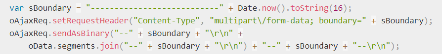

# POST方法

> 2019-12-17 @wsl

**HTTP POST 方法** 发送数据给服务器，请求主体的类型由 [`Content-Type`](https://developer.mozilla.org/zh-CN/docs/Web/HTTP/Headers/Content-Type) 首部指定。

POST方法是**非幂等**的方法，因为这个请求可能会创建新的资源或/和修改现有资源。

- POST 请求不会被缓存
- POST 请求不会保留在浏览器历史记录中
- POST 不能被收藏为书签
- POST 请求对数据长度没有要求

## 1、请求数据

服务端通常是根据请求头（headers）中的 Content-Type 字段来获知请求中的消息主体是用何种方式编码，再对主体进行解析。所以说到 POST 提交数据方案，包含了 Content-Type 和消息主体编码方式两部分。

Content-Type

- application/x-www-form-urlencoded（标准）
- multipart/form-data（标准）
- application/json（非标准）
- text/xml
- text/plain

### application/x-www-form-urlencoded

请求头中的Content-Type设置为application/x-www-form-urlencoded；提交的数据被编码成以 '&' 分隔的键-值对，同时以 '=' 分隔键和值。非字母或数字的字符会被 [percent-encoding](https://developer.mozilla.org/en-US/docs/Glossary/percent-encoding)：这也就是为什么这种类型不支持二进制数据（应使用 `multipart/form-data` 代替）。

其实就是和 GET 请求的数据提交格式是一样的，只不过位置从 Request URL 上换到了 Request Body 里。

```http
POST /test.html HTTP/1.1
Host: foo.com
Content-Type: application/x-www-form-urlencoded
Content-Length: 13

say=Hi&to=Mom
```

**适用场景：数据量不大、数据层级不深的情况。**

### multipart/form-data

当你需要提交文件、非 ASCII 码的数据或者是二进制流数据，则使用这种提交方式。

请求头中的Content-Type 是multipart/form-data; 并且会随机生成一个boundary, 用于区分请求body中的各个数据; 每个数据以 --boundary 开始, 紧接着换行,下面是内容描述信息, 接着换2行, 接着是数据; 然后以 --boundary-- 结尾, 最后换行。

```http
POST http://www.example.com HTTP/1.1
Content-Type:multipart/form-data; boundary=----WebKitFormBoundaryPAlLG7hJKNYc4ft3

------WebKitFormBoundaryrGKCBY7qhFd3TrwA
Content-Disposition: form-data; name="text"

demo
------WebKitFormBoundaryPAlLG7hJKNYc4ft3
Content-Disposition: form-data; name="file"; filename="demo.png"
Content-Type: image/png

------WebKitFormBoundaryPAlLG7hJKNYc4ft3--
```

**适用场景：文件上传。**

### application/json

```http
POST http://www.example.com HTTP/1.1 
Content-Type: application/json;charset=utf-8

{"name":"xfly","age": 24, "hobby":["x","xx","xxx"]}
```

**适用场景：数据结构较复杂，层级较深的情况。**

### text/plain

```http
POST http://www.example.com HTTP/1.1 
Content-Type: text/plain

foo=bar
baz=The first line.
The second line.
```


## 2、请求方式

- html \<form\>表单
- fetch
- xhr(axios)
- SSE
- WebSocket

### html \<form\>表单

html \<form\> 可以被以四种方式发送：（自动地） 

1. 使用 POST 方法并设置 enctype 属性为  application/x-www-form-urlencoded（默认）。
2. 使用 POST 方法并设置 enctype 属性为 multipart/form-data FormData
3. 使用 POST 方法并设置 enctype 属性为 text/plain
4. 使用 GET 方法（这种情况下 enctype 属性会被忽略）

### xhr(axios)

1. 使用 application/x-www-form-urlencoded

2. - 方法1：使用 [URLSearchParams ](https://developer.mozilla.org/zh-CN/docs/Web/API/URLSearchParams)实例作为 body（xhr.send(body)）

3. - 方法2：设置 Content-Type Header       为 application/x-www-form-urlencode

     然后自己编码（如果直接使用字符串作为 body 则实际会被浏览器解析 Content-Type 为 text/plain） 

     ```javascript
     import axios from 'axios';
     const queryString = require('qs');
     
     axios.post(
     	url,
         queryString.stringify(data),
         { headers: { 'Content-Type': 'application/x-www-form-urlencoded' }},
     );
     ```

2. multipart/form-data

1. - 方法1：不要设置 Content-Type，传输 data 为 [FormData](https://developer.mozilla.org/zh-CN/docs/Web/API/FormData) 的实例，浏览器会自动处理

     ```javascript
     import axios from 'axios'
     
     let data = new FormData();
     data.append(key, value);
     
     axios.post(url, data);
     ```

2. - 方法2：手动设置 Content-Type（还需要设置 boundary，比较麻烦）
     需要注意：如果要设置 requestHeader('Content-Type', 'multipart\/form-data')是不够的，还需要加上 boundary

     

3. application/json（非标准）

   设置 Content-Type 为 'application/json;charset=utf-8'，JSON 序列化处理 data： JSON.stringify(data)

   ```javascript
   import axios from 'axios'
   
   axios.post(url, data);
   ```

4. application/json-seq [rfc7464](https://tools.ietf.org/html/rfc7464)（非标准，json 序列）

1. 分隔符（标准：RS = %x1E）


## 参考链接

[MDN|POST](https://developer.mozilla.org/zh-CN/docs/Web/HTTP/Methods/POST)

[MDN|Using XMLHTMLRequest](https://developer.mozilla.org/en-US/docs/Web/API/XMLHttpRequest/Using_XMLHttpRequest#Submitting_forms_and_uploading_files)

[简书|Http POST请求数据提交格式](https://www.jianshu.com/p/4f9e79eb0163)

[W3School|HTTP 方法：GET 对比 POST](https://www.w3school.com.cn/tags/html_ref_httpmethods.asp)

[掘金|POST 请求的三种常见数据提交格式](https://juejin.im/post/5d084232e51d45554877a5db)

[Why I still use XHR instead of the Fetch API](https://gomakethings.com/why-i-still-use-xhr-instead-of-the-fetch-api/)

[XMLHttpRequest vs the Fetch API: What’s Best for Ajax in 2019?](https://www.sitepoint.com/xmlhttprequest-vs-the-fetch-api-whats-best-for-ajax-in-2019/)

[axios POST提交数据的三种请求方式写法](https://segmentfault.com/a/1190000015261229)