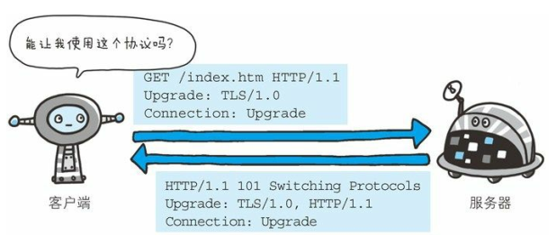

# Upgrade

>2018-11-29 @wsl

首部字段 Upgrade 用于检测 HTTP 协议及其他协议是否可使用更高的版本进行通信， 其参数值可以用来指定一个完全不同的通信协议。 

上图用例中， 首部字段 Upgrade 指定的值为 TLS/1.0。 请注意此处两个字段首部字段的对应关系， Connection 的值被指定为 Upgrade。Upgrade 首部字段产生作用的 Upgrade 对象仅限于客户端和邻接服务器之间。 因此， 使用首部字段 Upgrade 时， 还需要额外指定 Connection:Upgrade。
对于附有首部字段 Upgrade 的请求， 服务器可用 101 Switching Protocols 状态码作为响应返回。 

