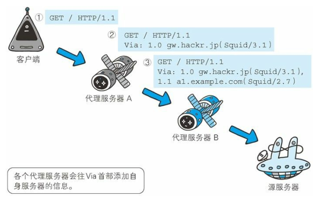

# Via

> 2018-11-29 @wsl

使用首部字段 Via 是为了追踪客户端与服务器之间的请求和响应报文的传输路径。 

报文经过代理或网关时，会先在首部字段 Via 中附加该服务器的信息，然后再进行转发。这个做法和 traceroute 及电子邮件的 Received 首部的工作机制很类似。 

首部字段 Via 不仅用于追踪报文的转发，还可避免请求回环的发生。所以必须在经过代理时附加该首部字段内容。 

上图用例中， 在经过代理服务器 A 时，Via 首部附加了“1.0 gw.hackr.jp (Squid/3.1)”这样的字符串值。行头的 1.0 是指接收请求的服务器上应用的 HTTP 协议版本。接下来经过代理服务器 B 时亦是如此，在 Via 首部附加服务器信息，也可增加 1 个新的 Via 首部写入服务器信息。
Via 首部是为了追踪传输路径，所以经常会和 TRACE 方法一起使用。比如，代理服务器接收到由 TRACE 方法发送过来的请求（其中 Max-Forwards: 0）时，代理服务器就不能再转发该请求了。这种情况下，代理服务器会将自身的信息附加到 Via 首部后，返回该请求的响应。 

