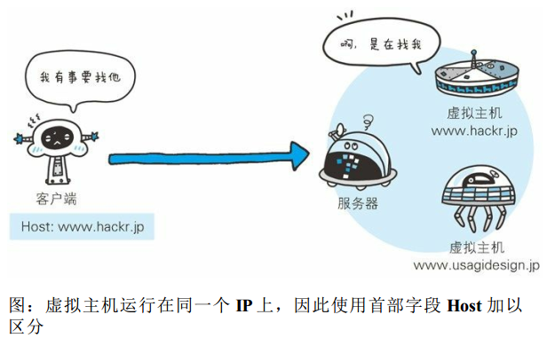

# Host

> 2018-12-04 @wsl

首部字段 Host 会告知服务器，请求的资源所处的互联网主机名和端口号。

Host 首部字段是 HTTP/1.1 规范内是唯一一个必须被包含在请求内的首部字段。

```
Host: www.hackr.jp
```



首部字段 Host 和以单台服务器分配多个域名的虚拟主机的工作及制有密切的关联，这是首部字段 Host 必须存在的意义。

请求被发送至服务器时，请求中的主机名会用 IP 地址直接替换解决。但如果这时，相同的 IP 地址下部署运行着多个域名时，那么服务器就会无法理解究竟是哪个域名对应的请求。因此，就需要使用首部字段 Host 来明确指出请求的主机名。若服务器未设定主机名，那直接发送一个空值即可。

```
Host: 
```

