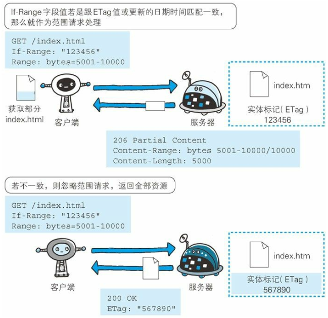

# If-Range

> 2018-12-09 @wsl

首部字段 If-Range 属于附带条件之一。它告知服务器若指定 If-Range 字段值（ETag 值或者时间）和请求资源的 ETag 值或时间相一致时，则作为范围请求处理。反之，则返回全体资源。

如果不使用 If-Range 时，则需要进行两次处理。服务器端的资源如果更新，那客户端持有资源中的一部分也会随之无效，当然，范围请求作为前提也是无效的。这时，服务器会暂且以状态码 412 Precondition Failed 作为响应返回，其目的是催促客户端再次发送请求。这样一来，与使用首部字段 If-Range 比起来，就需要花费两倍功夫。

