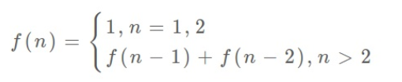

# 动态规划

## 思路

1、动态规划问题的一般形式就是求最值。

2、求解动态规划的核心问题是穷举。

3、如何穷举？动态规划三要素：重叠子问题、最优子结构、状态转移方程。

4、思考过程：明确「状态」 -> 定义 dp 数组/函数的含义 -> 明确「选择」 -> 明确 base
case。 

## 裴波那契数列

### 暴力递归

以裴波那契数列举例，递归法求解：

```js
function fib(n) {
    if (n < 1) return 0;
    if (n === 1 || n === 2) return 1;
    return fib(n - 1) + fib(n - 2);
}
```

递归算法的时间复杂度怎么计算？ 子问题个数乘以解决⼀个子问题需要的时间。 

子问题个数，即递归树中节点的总数。这种写法，递归得到一个二叉树，子问题个数2^n，单个子问题需要的时间为O(1)，所以，这个算法的时间复杂度为O(2^n)，简直爆炸。

可以看到这种算法存在大量重复计算，例如除了n=1, 2,n，其他每个都会重复计算2次，这种，就是**重叠子问题**。首先，要解决这种问题来优化算法。

### 带备忘录的递归解法

既然因为重复计算导致的时间复杂度为指数级别，那么可以建一个「备忘录」，计算得到结果后保存到「备忘录」中，再次获取结果时就不用重复计算了。

一般使用一个数组充当这个「备忘录」 ， 当然也可以使用哈希表（字典），思想都是⼀样的。 

```js
function fib(n) {
    if (n < 1) return 0;
    // 初始化备忘录
    const memo = [];
    // 递归计算
    return getFib(memo, n);
}

function getFib(memo, n) {
    // base case
    if (n === 1 || n === 2) return 1;
    // 已经计算过
    if (memo[n]) return memo[n];
    // 计算新值
    memo[n] = getFib(memo, n - 1) + getFib(memo, n - 2);
    return memo[n];
}
```

可以看到，这种算法，每个子问题只会计算一次，单个子问题计算需要的时间为O(1)，可得算法的时间复杂度为O(n)。比起暴力算法， 是降维打击。

至此，带备忘录的递归解法的效率已经和迭代的动态规划解法⼀样了。实际上，这种解法和迭代的动态规划已经差不多了，只不过这种方法叫做「自顶向下」，动态规划叫做「自底向上」。

啥叫「自顶向下」？注意刚才递归树（或者说图），是从上向下延伸，都是从⼀个规模较大的原问题比如说 f(20) ，向下逐渐分解规模，直到 f(1) 和 f(2) 触底，然后逐层返回答案，这就叫「自顶向下」。

啥叫「自底向上」？反过来，我们直接从最底下，最简单，问题规模最小的 f(1) 和 f(2) 开始往上推，直到推到我们想要的答案 f(20) ，这就是动态规划的思路，这也是为什么动态规划⼀般都脱离了递归，而是由循环迭代完成计算。

### dp 数组的迭代解法

有了上一步「备忘录」 的启发，我们可以把这个「备忘录」独立出来成为⼀张表，就叫做 DP table 吧， 在这张表上完成「自底向上」 的推算岂不美哉！ 

```js
function fib(n) {
    if (n < 0) return 0;
    // base case
    const dp = [0, 1, 1];
    for (let i = 3; i <= n; i++) {
        dp[i] = dp[i - 1] + dp[i - 2];
    }
    return dp[n];
}
```

可以看到这种解法的DP table和上一个剪枝后的递归树很像，只是反过来计算而已。实际上，上一个解法最终得到的「备忘录」 就是这个 DP table，所以说这两种解法其实是差不多的，大部分情况下，效率也基本相同。

这里， 引出「**状态转移方程**」这个名词，实际上就是描述问题结构的数学形式：



为什么叫「状态转移方程」？可以看到，状态 n 是由状态 n - 1 和状态 n - 2 相加转移而来，这就叫状态转移。

可以看到上面的几种解法，都是围绕这个方程式的不同表现形式。可见列出「状态转移方程」的重要性，它是解决问题的核心。可以发现，其实状态转移方程直接代表着暴力解法。

千万不要看不起暴力解， 动态规划问题最困难的就是写出状态转移方程， 即这个暴力解。 优化方法无非是用备忘录或者 DP table， 再无奥妙可言。

最后，还有一个细节优化。可以看到裴波那契数列的状态只和前两个相关，因此无需存储所有的状态，只要存储前两个状态就可以了，空间复杂度可以优化为O(1)。

```js
function fib(n) {
    if (n <= 0) return 0;
    let pre = 1;
    let curr = 1;
    for (let i = 3; i <= n; i++) {
        const sum = pre + curr;
        pre = curr;
        curr = sum;
    }
    return curr;
}
```

裴波那契数列严格来说不算动态规划，因为没有涉及到求最值。动态规划还有一个重要特性，最优子结构，可以在下面的例子中体现。

## 凑零钱问题

题目：

给你 `k` 种面值的硬币，面值分别为 `c1, c2 ... ck`，每种硬币的数量无限，再给一个总金额 `amount`，问你**最少**需要几枚硬币凑出这个金额，如果不可能凑出，算法返回 -1 。

算法签名：

```c++
// coins 中是可选硬币面值，amount 是目标金额
int coinChange(int[] coins, int amount);
```

### 暴力递归

首先，这个问题是动态规划问题，因为它具有“最优子结构”的。**要符合“最优子结构”，子问题间必须互相独立。**

既然知道了这是个动态规划问题，就要思考**如何列出正确的状态转移方程**？

1. 确定 base case。
   目标金额为0时，算法返回0，因为不需要任何硬币就已经凑出目标金额了。
2. 确定“状态”，也就是原问题和子问题中会变化的变量。
   本题“状态”为目标金额。
3. 确定“选择”，也就是导致“状态”产生变化的行为。
   选择了一枚硬币，目标金额就会对应发生变化，所以“选择”为所有的硬币面值。
4. 明确 `dp` 函数/数组的定义。
   自顶向下的解法，会有一个递归的 `dp` 函数，一般来说函数的参数就是状态转移中会变化的量，即“状态”；函数的返回值就是题目要求我们计算的量。本题状态只有一个，即“目标金额”，题目要求我们计算凑出目标金额所需的最小硬币数量。因此可以这样定义 `dp` 函数：
   `dp(n)` -- 输入一个目标金额 n，返回凑出目标金额 n 的最少硬币数量。

通过分析得到题解代码：

```js
function coinChange(coins, amount) {
    function dp(n) {
        // base case
        if (n === 0) return 0;
        if (n < 0) return -1;
        
        // 求最小值，所以初始化为最大整数
        let count = Number.MAX_SAFE_INTEGER;
        for (let i = 0; i < coins.length; i++) {
            const sub = dp(n - coins[i]);
            // 子问题为-1是无解，跳过
            if (sub !== -1) count = Math.min(count, sub + 1);
        }
        return count === Number.MAX_SAFE_INTEGER ? -1 : count;
    }
    
    return dp(amount);
}
```

上面算法就是暴力解法了，没有考虑重叠子问题。状态转移方程为：


**递归算法的时间复杂度分析：子问题总数 x 每个子问题的时间**。

子问题总数为递归树节点个数，这个比较难看出来，是 O(n^k)，总之是指数级别的。每个子问题中含有一个 for 循环，复杂度为 O(k)。所以总时间复杂度为 O(k * n^k)，指数级别。

### 带备忘录的递归解法

上个解法加个备忘录，就可以消除重叠子问题：

```js
function coinChange(coins, amount) {
    var map = {};

    function dp(n) {
        // 备忘录查找，避免重复计算
        if (map[n]) return map[n];
        // base case
        if (n < 0) return -1;
        if (n === 0) return 0;
        
        var count = Number.MAX_SAFE_INTEGER;
        for(let i = 0; i < coins.length; i++) {
            const sub = dp(n - coins[i]);
            if (sub !== -1) count = Math.min(count, sub + 1);
        }
        // 记入备忘录
        map[n] = count === Number.MAX_SAFE_INTEGER ? -1 : count;
        return map[n];
    }
    
    return dp(amount);
}
```

显然「备忘录」大大减小了子问题数目，完全消除了子问题的冗余，所以子问题总数不会超过金额数 `n`，即子问题数目为 O(n)。处理一个子问题的时间不变，仍是 O(k)，所以总的时间复杂度是 O(kn)

### dp 数组的迭代解法

当然，我们也可以自底向上使用 dp table 来消除重叠子问题，关于「状态」「选择」和 base case 与之前没有区别，`dp` 数组的定义和刚才 `dp` 函数类似，也是把「状态」，也就是目标金额作为变量。不过 `dp` 函数体现在函数参数，而 `dp` 数组体现在数组索引：

**dp** **数组的定义：当目标金额为** **i** **时，至少需要** **dp[i]** **枚硬币凑出**。

```js
function(coins, amount) {
    // 数组大小为 amount + 1，初始值也为 amount + 1
    const dp = new Array(amount + 1).fill(amount + 1);
	// base case
    dp[0] = 0;
	// 外层 for 循环在遍历所有状态的所有取值
    for (let i = 0; i < dp.length; i++) {
        // 内层循环在求所有选择的最小值
        coins.forEach((coin) => {
            if (i - coin >= 0) {
                dp[i] = Math.min(dp[i], dp[i - coin] + 1);
            }
        });
    }
    
    return dp[amount] === amount + 1 ? -1 : dp[amount];
};
```

> 为啥 `dp` 数组初始化为 `amount + 1` 呢，因为凑成 `amount` 金额的硬币数最多只可能等于 `amount`（全用 1 元面值的硬币），所以初始化为 `amount + 1` 就相当于初始化为正无穷，便于后续取最小值。

## 总结

**计算机解决问题其实没有任何奇技淫巧，它唯一的解决办法就是穷举**，穷举所有可能性。算法设计无非就是先思考“如何穷举”，然后再追求“如何聪明地穷举”。

列出动态转移方程，就是在解决“如何穷举”的问题。之所以说它难，一是因为很多穷举需要递归实现，二是因为有的问题本身的解空间复杂，不那么容易穷举完整。

备忘录、DP table 就是在追求“如何聪明地穷举”。用空间换时间的思路，是降低时间复杂度的不二法门。


## 参考链接

[动态规划解题套路框架 - labuladong的算法小抄](https://labuladong.gitbook.io/algo/di-ling-zhang-bi-du-xi-lie/dong-tai-gui-hua-xiang-jie-jin-jie#er-cou-ling-qian-wen-ti)


