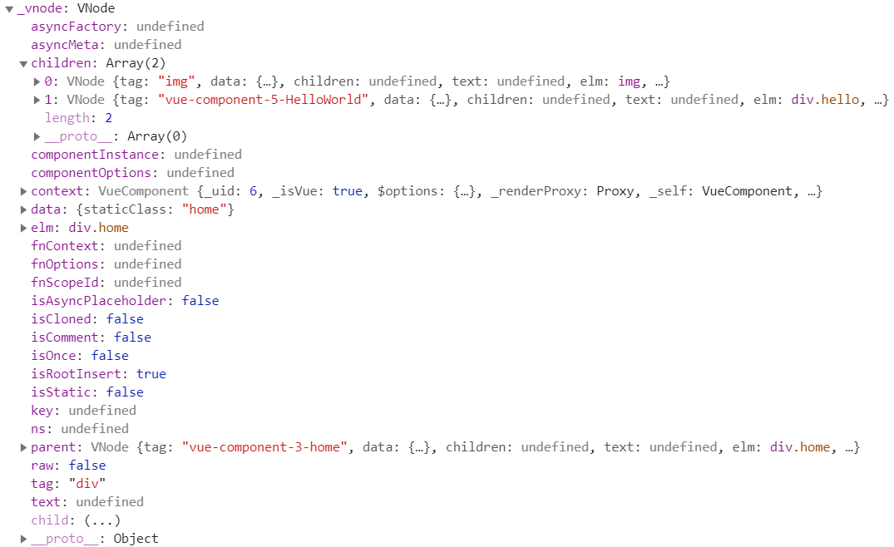
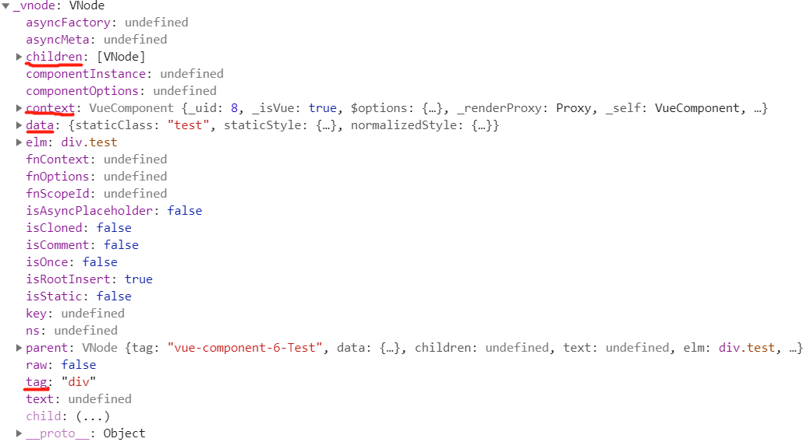
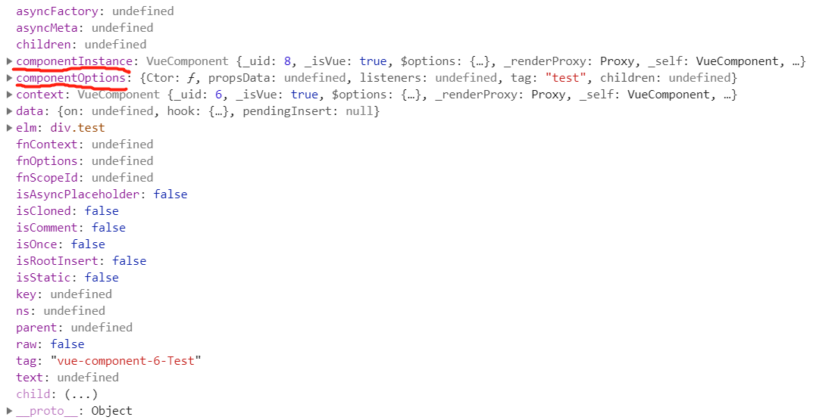

# 虚拟Dom

> 2019.08.05 @wsl

## 一、虚拟Dom简介

### 1. 什么是虚拟Dom

命令式操作Dom，随着业务逻辑的复杂化，程序中的状态容易变得难以管理，代码逻辑混乱。

主流框架vue、angular，react都是声明式操作Dom，我们通过描述状态与Dom之间的映射关系，将状态渲染成视图。状态到视图的转换工作，框架帮我们完成，不需要手动操作。

程序运行中，状态可能发生变化，如果全部重新渲染，会造成很大的性能浪费，虚拟Dom就是优化这部分的处理而提出的一种解决方案。Vue2.0起采用的就是虚拟Dom的解决方案。

虚拟Dom的解决方式是通过状态生成一个虚拟节点树，然后使用虚拟节点树进行渲染。在渲染之前，会使用新生成的虚拟节点树和上一次生成的虚拟节点树进行对比，只渲染不同的部分。

虚拟节点树其实是由组件树建立起来的整个虚拟节点。


### 2. 为什么要引入虚拟Dom

vue1.0时，采用细粒度的变化侦测，可以根据状态变化直接更新对应的节点，但是这需要每一个都绑定一个对应的watcher来观察状态变化，随着节点的增多，这样的开销非常大。

因此，vue2.0引入中等粒度的方案，以组件为单位，对应一个watcher实例，每次状态变化通知对应的组件，组件内部通过虚拟Dom去进行比对和渲染。


### 3. vue.js中的虚拟Dom

vue.js通过模板来描述状态与视图之间的映射关系。通过编译将模板转换成渲染函数，执行渲染函数就可以得到一个虚拟节点树，使用这个虚拟节点树就可以渲染页面。


虚拟Dom在vue中所做的就是：

- 提供与真实Dom节点所对应的虚拟节点vnode
- 将虚拟节点vnode和旧虚拟节点oldVnode进行比对，然后更新视图。


## 二、 VNode

### 1. 什么是VNode

vue.js中声明了一个Vnode类，使用它可以实例化不同类型的vnode实例，表示不同类型的Dom元素。

Dom元素有元素节点、文本节点和注释节点等，vnode实例也对应着有元素节点、文本节点和注释节点等。

Vnode类声明如下：

```javascript
export default class VNode {
	constructor (tag, data, children, text, elm, context, componentOptions, asyncFactory) {
    this.tag = tag // 元素节点的名称
    this.data = data // 节点数据
    this.children = children // 子节点
    this.text = text // 文本节点的文本
    this.elm = elm // 对应的Dom节点
    this.ns = undefined // 节点命名空间，针对svg标签的属性
    this.context = context // 组件上下文
    this.fnContext = undefined // 功能节点的实际实例上下文
    this.fnOptions = undefined // 方法配置选项，只在服务器渲染使用
    this.fnScopeId = undefined // 方法作用域id
    this.key = data && data.key // 节点唯一键
    this.componentOptions = componentOptions // 虚拟节点组件配置对象
    this.componentInstance = undefined // 组件实例
    this.parent = undefined // 组件占位符节点
    this.raw = false // 是否包含原始HTML。只有服务器端会使用
    this.isStatic = false // 是否静态节点，静态节点将会被提升
    this.isRootInsert = true // 是否在根节点插入，进入转换检查所必需的
    this.isComment = false // 是否空注释占位符
    this.isCloned = false // 是否拷贝节点
    this.isOnce = false // 是否一次性节点
    this.asyncFactory = asyncFactory // 异步组件工厂方法
    this.asyncMeta = undefined // 异步源
    this.isAsyncPlaceholder = false // 是否异步占位符
  }

  get child () {
    return this.componentInstance
  }
}
```

可以看出，vnode本质上是JavaScript中一个普通的对象，是从Vnode类实例化的对象。通过这个对象来描述一个真实的Dom元素。



vnode可以理解为**节点描述对象**，它描述了应该怎样去创建真实的Dom节点。

vnode表示一个真实的Dom元素，所有真实的Dom节点都使用vnode创建并插入到页面中。


上图为使用vnode创建真实Dom并渲染到视图的过程。可见，vnode和视图是一一对应的。可以把vnode看成JavaScript对象版本的Dom元素。

渲染视图的过程是先创建vnode，然后再使用vnode生成真实的Dom元素，最后插入到页面渲染视图。

### 2. VNode的作用

vue.js 目前对状态的侦测策略采用了中等粒度。当状态发生变化时，只通知到组件级别，组件内部使用虚拟Dom来渲染视图。

即，组件使用的众多状态中有一个发生变化，整个组件就要重新渲染。

如果组件只有一个节点发生了变化，重新渲染整个组件的所有节点，很明显会造成很大的性能浪费。因此，对vnode进行缓存，并将上一次缓存的vnode和当前新创建的vnode进行对比，只更新发生变化的节点就变得尤为重要。这也是vnode最重要的一个作用。

### 3. VNode的类型

vnode的类型有以下几种：

- 注释节点
- 文本节点
- 元素节点
- 组件节点
- 函数式组件
- 克隆节点

vnode是JavaScript中的一个对象，不同类型的vnode之间其实只是属性不同，准确说是有效属性不同。因为当使用VNode类创建一个vnode时，通过参数为实例设置属性时，无效属性会默认赋值为undefined或false，可以直接忽略。

#### 3.1 注释节点

```javascript
export const createEmptyVNode = (text) => {
  const node = new VNode()
  node.text = text
  node.isComment = true
  return node
}
```

可以看出，一个注释节点只有两个有效属性，text 和 isComment，其余属性全是默认的undefined或false。

实例：

```html
<!-- 注释节点 -->
```

对应vnode：

```javascript
{
    text: "注释节点",
    isComment: true
}
```

#### 3.2 文本节点

```javascript
export function createTextVNode (val) {
  return new VNode(undefined, undefined, undefined, String(val))
}
```

通过上面的代码可以知道，文本类型的vnode被创建时，只有一个text属性。

#### 3.3 克隆节点

克隆节点是将现有节点的属性复制到新节点中，让新创建的节点和被克隆的节点的属性保持一致，从而实现克隆效果。它的作用是优化静态节点和插槽节点（slot node）。

以静态节点为例，当组件内的某个状态发生变化后，当前组件会通过虚拟Dom重新渲染视图，静态节点因为它的内容不会改变，所以除了首次渲染需要执行渲染函数获取vnode之外，后续更新不需要执行渲染函数重新生成vnode。因此这时就会使用创建克隆节点的方法将vnode克隆一份，使用克隆节点进行渲染。这样就不需要重新执行渲染函数生成新的静态节点的vnode，从而提升一定程度的性能。

```javascript
export function cloneVNode (vnode: VNode): VNode {
  const cloned = new VNode(
    vnode.tag,
    vnode.data,
    vnode.children && vnode.children.slice(),
    vnode.text,
    vnode.elm,
    vnode.context,
    vnode.componentOptions,
    vnode.asyncFactory
  )
  cloned.ns = vnode.ns
  cloned.isStatic = vnode.isStatic
  cloned.key = vnode.key
  cloned.isComment = vnode.isComment
  cloned.fnContext = vnode.fnContext
  cloned.fnOptions = vnode.fnOptions
  cloned.fnScopeId = vnode.fnScopeId
  cloned.asyncMeta = vnode.asyncMeta
  cloned.isCloned = true
  return cloned
}
```

可以看出，克隆现有节点时，只需要将现有节点的属性全部复制到新节点中即可。克隆节点和被克隆节点的唯一区别是isCloned属性。

#### 3.4 元素节点

元素节点通常会存在以下4种有效属性：

- tag：节点名称。如p, ul, li, div等。
- data：一些节点上的数据。如attrs, class, style等。
- children：当前节点的子节点列表。
- context：当前组件的Vue.js实例。



#### 3.5 组件节点

组件节点和元素节点类似，有以下两个独有的属性。

- componentOptions：组件节点的选项参数，其中包含propsData, tag, children等信息。
- componentInstance：组件实例，也是Vue.js的实例。事实上，在vue.js中，每个组件都是一个vue.js实例。



#### 3.6 函数式组件

函数式组件和组件节点类似，它有两个独有的属性 fnContext 和 fnOptions。

通常，一个函数式组件的vnode是下面的样子：

```javascript
{
    componentInstance: {...},
    componentOptions: {...},
    context: {...},
    data: {...},
    tag: "div"
}
```

ps: 函数式组件

functional: true

无状态、无实例、没有this上下文、无生命周期

我们可以把函数式组件想像成组件里的一个函数，入参是渲染上下文(render context)，返回值是渲染好的HTML

对于函数式组件，可以这样定义：

- Stateless(无状态)：组件自身是没有状态的
- Instanceless(无实例)：组件自身没有实例，也就是没有this

由于函数式组件拥有的这两个特性，我们就可以把它用作高阶组件(High order components)，所谓高阶，就是可以生成其它组件的组件。

## 三、patch


## 参考链接

函数式组件：<https://cn.vuejs.org/v2/guide/render-function.html#%E5%87%BD%E6%95%B0%E5%BC%8F%E7%BB%84%E4%BB%B6>

