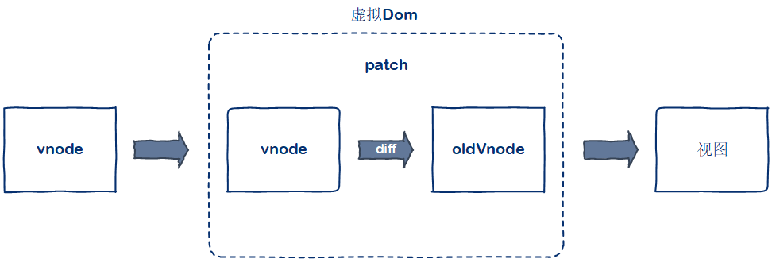

# 虚拟Dom

> 2019.08.05 @wsl

## 1. 什么是虚拟Dom

命令式操作Dom，随着业务逻辑的复杂化，程序中的状态容易变得难以管理，代码逻辑混乱。

主流框架vue、angular，react都是声明式操作Dom，我们通过描述状态与Dom之间的映射关系，将状态渲染成视图。状态到视图的转换工作，框架帮我们完成，不需要手动操作。

程序运行中，状态可能发生变化，如果全部重新渲染，会造成很大的性能浪费，虚拟Dom就是优化这部分的处理而提出的一种解决方案。Vue2.0起采用的就是虚拟Dom的解决方案。

虚拟Dom的解决方式是通过状态生成一个虚拟节点树，然后使用虚拟节点树进行渲染。在渲染之前，会使用新生成的虚拟节点树和上一次生成的虚拟节点树进行对比，只渲染不同的部分。

虚拟节点树其实是由组件树建立起来的整个虚拟节点。

## 2. 为什么要引入虚拟Dom

vue1.0时，采用细粒度的变化侦测，可以根据状态变化直接更新对应的节点，但是这需要每一个都绑定一个对应的watcher来观察状态变化，随着节点的增多，这样的开销非常大。

因此，vue2.0引入中等粒度的方案，以组件为单位，对应一个watcher实例，每次状态变化通知对应的组件，组件内部通过虚拟Dom去进行比对和渲染。

## 3. vue.js中的虚拟Dom

vue.js通过模板来描述状态与视图之间的映射关系。通过编译将模板转换成渲染函数，执行渲染函数就可以得到一个虚拟节点树，使用这个虚拟节点树就可以渲染页面。

虚拟Dom在vue中所做的就是：

- 提供与真实Dom节点所对应的虚拟节点vnode
- 将虚拟节点vnode和旧虚拟节点oldVnode进行比对，然后更新视图。

