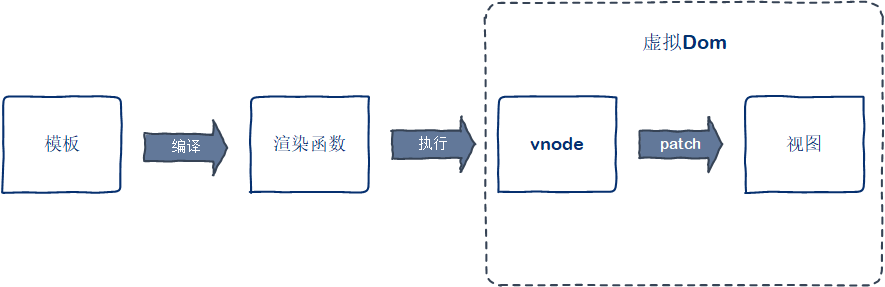
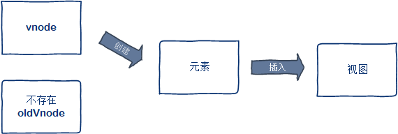
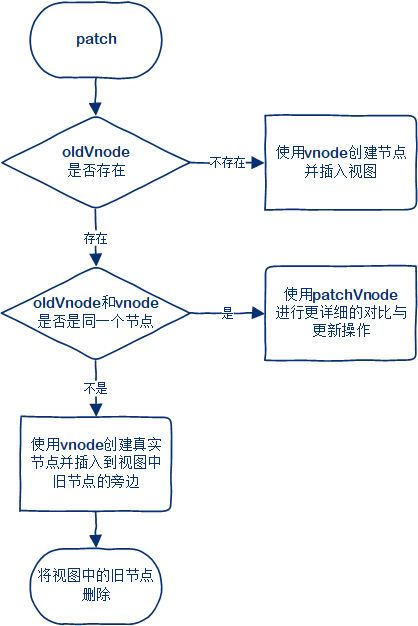
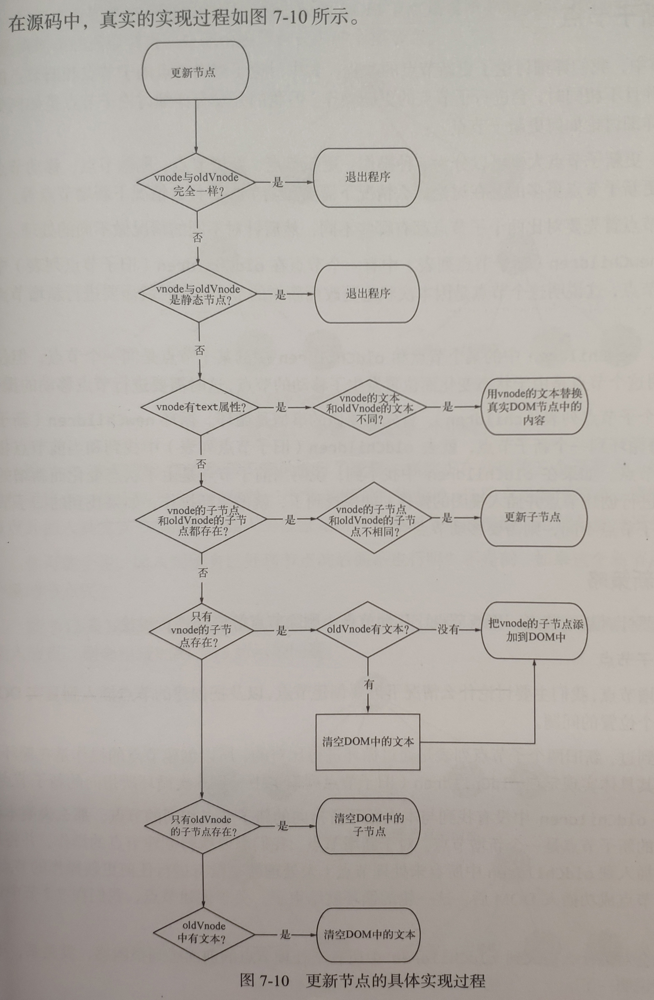
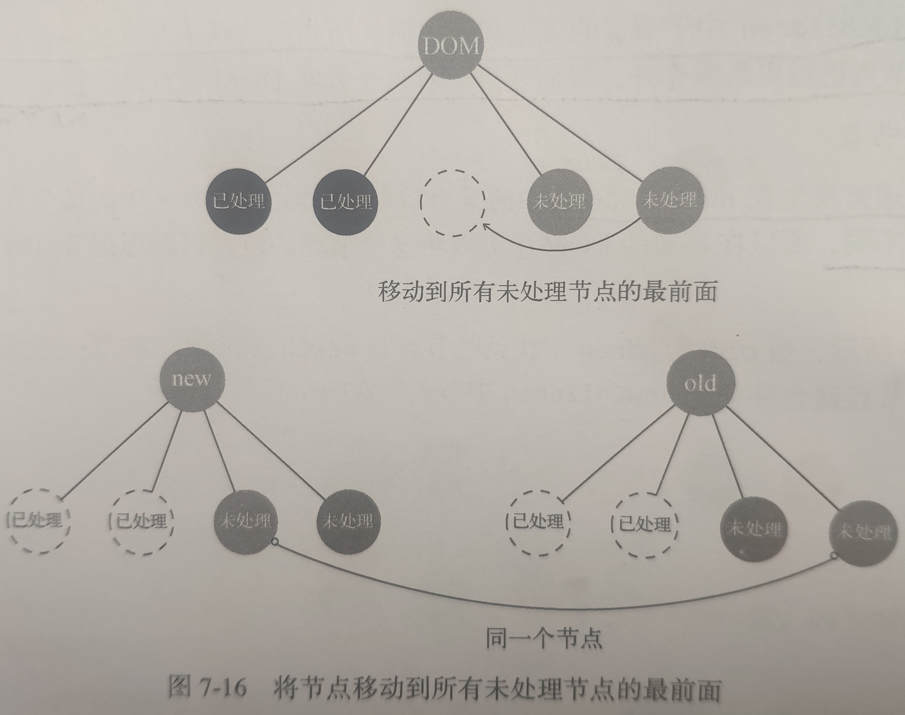
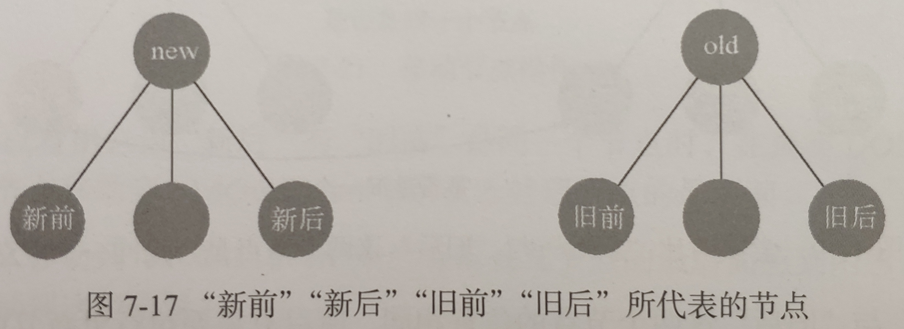
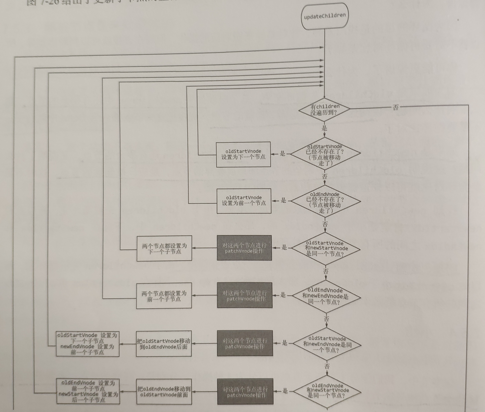
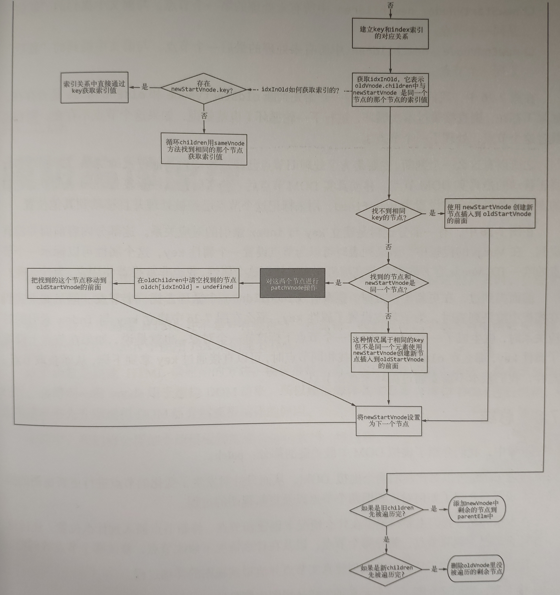

# 虚拟Dom

> 2019.08.05 @wsl

## 一、虚拟Dom简介

### 1. 什么是虚拟Dom

命令式操作Dom，随着业务逻辑的复杂化，程序中的状态容易变得难以管理，代码逻辑混乱。

主流框架vue、angular，react都是声明式操作Dom，我们通过描述状态与Dom之间的映射关系，将状态渲染成视图。状态到视图的转换工作，框架帮我们完成，不需要手动操作。

程序运行中，状态可能发生变化，如果全部重新渲染，会造成很大的性能浪费，虚拟Dom就是优化这部分的处理而提出的一种解决方案。Vue2.0起采用的就是虚拟Dom的解决方案。

虚拟Dom的解决方式是通过状态生成一个虚拟节点树，然后使用虚拟节点树进行渲染。在渲染之前，会使用新生成的虚拟节点树和上一次生成的虚拟节点树进行对比，只渲染不同的部分。

虚拟节点树其实是由组件树建立起来的整个虚拟节点。


### 2. 为什么要引入虚拟Dom

vue1.0时，采用细粒度的变化侦测，可以根据状态变化直接更新对应的节点，但是这需要每一个都绑定一个对应的watcher来观察状态变化，随着节点的增多，这样的开销非常大。

因此，vue2.0引入中等粒度的方案，以组件为单位，对应一个watcher实例，每次状态变化通知对应的组件，组件内部通过虚拟Dom去进行比对和渲染。


### 3. vue.js中的虚拟Dom

vue.js通过模板来描述状态与视图之间的映射关系。通过编译将模板转换成渲染函数，执行渲染函数就可以得到一个虚拟节点树，使用这个虚拟节点树就可以渲染页面。



虚拟Dom在vue中所做的就是：

- 提供与真实Dom节点所对应的虚拟节点vnode
- 将虚拟节点vnode和旧虚拟节点oldVnode进行比对，然后更新视图。


## 二、 VNode

### 1. 什么是VNode

vue.js中声明了一个VNode类，使用它可以实例化不同类型的vnode实例，表示不同类型的Dom元素。

Dom元素有元素节点、文本节点和注释节点等，vnode实例也对应着有元素节点、文本节点和注释节点等。

Vnode类声明如下：

```javascript
export default class VNode {
	constructor (tag, data, children, text, elm, context, componentOptions, asyncFactory) {
    this.tag = tag // 元素节点的名称
    this.data = data // 节点数据
    this.children = children // 子节点
    this.text = text // 文本节点的文本
    this.elm = elm // 对应的Dom节点
    this.ns = undefined // 节点命名空间，针对svg标签的属性
    this.context = context // 组件上下文
    this.fnContext = undefined // 功能节点的实际实例上下文
    this.fnOptions = undefined // 方法配置选项，只在服务器渲染使用
    this.fnScopeId = undefined // 方法作用域id
    this.key = data && data.key // 节点唯一键
    this.componentOptions = componentOptions // 虚拟节点组件配置对象
    this.componentInstance = undefined // 组件实例
    this.parent = undefined // 组件占位符节点
    this.raw = false // 是否包含原始HTML。只有服务器端会使用
    this.isStatic = false // 是否静态节点，静态节点将会被提升
    this.isRootInsert = true // 是否在根节点插入，进入转换检查所必需的
    this.isComment = false // 是否空注释占位符
    this.isCloned = false // 是否拷贝节点
    this.isOnce = false // 是否一次性节点
    this.asyncFactory = asyncFactory // 异步组件工厂方法
    this.asyncMeta = undefined // 异步源
    this.isAsyncPlaceholder = false // 是否异步占位符
  }

  get child () {
    return this.componentInstance
  }
}
```

可以看出，vnode本质上是JavaScript中一个普通的对象，是从Vnode类实例化的对象。通过这个对象来描述一个真实的Dom元素。


vnode可以理解为**节点描述对象**，它描述了应该怎样去创建真实的Dom节点。

vnode表示一个真实的Dom元素，所有真实的Dom节点都使用vnode创建并插入到页面中。


上图为使用vnode创建真实Dom并渲染到视图的过程。可见，vnode和视图是一一对应的。可以把vnode看成JavaScript对象版本的Dom元素。

渲染视图的过程是先创建vnode，然后再使用vnode生成真实的Dom元素，最后插入到页面渲染视图。

### 2. VNode的作用

vue.js 目前对状态的侦测策略采用了中等粒度。当状态发生变化时，只通知到组件级别，组件内部使用虚拟Dom来渲染视图。

即，组件使用的众多状态中有一个发生变化，整个组件就要重新渲染。

如果组件只有一个节点发生了变化，重新渲染整个组件的所有节点，很明显会造成很大的性能浪费。因此，对vnode进行缓存，并将上一次缓存的vnode和当前新创建的vnode进行对比，只更新发生变化的节点就变得尤为重要。这也是vnode最重要的一个作用。

### 3. VNode的类型

vnode的类型有以下几种：

- 注释节点
- 文本节点
- 元素节点
- 组件节点
- 函数式组件
- 克隆节点

vnode是JavaScript中的一个对象，不同类型的vnode之间其实只是属性不同，准确说是有效属性不同。因为当使用VNode类创建一个vnode时，通过参数为实例设置属性时，无效属性会默认赋值为undefined或false，可以直接忽略。

#### 3.1 注释节点

```javascript
export const createEmptyVNode = (text) => {
  const node = new VNode()
  node.text = text
  node.isComment = true
  return node
}
```

可以看出，一个注释节点只有两个有效属性，text 和 isComment，其余属性全是默认的undefined或false。

实例：

```html
<!-- 注释节点 -->
```

对应vnode：

```javascript
{
    text: "注释节点",
    isComment: true
}
```

#### 3.2 文本节点

```javascript
export function createTextVNode (val) {
  return new VNode(undefined, undefined, undefined, String(val))
}
```

通过上面的代码可以知道，文本类型的vnode被创建时，只有一个text属性。

#### 3.3 克隆节点

克隆节点是将现有节点的属性复制到新节点中，让新创建的节点和被克隆的节点的属性保持一致，从而实现克隆效果。它的作用是优化静态节点和插槽节点（slot node）。

以静态节点为例，当组件内的某个状态发生变化后，当前组件会通过虚拟Dom重新渲染视图，静态节点因为它的内容不会改变，所以除了首次渲染需要执行渲染函数获取vnode之外，后续更新不需要执行渲染函数重新生成vnode。因此这时就会使用创建克隆节点的方法将vnode克隆一份，使用克隆节点进行渲染。这样就不需要重新执行渲染函数生成新的静态节点的vnode，从而提升一定程度的性能。

```javascript
export function cloneVNode (vnode: VNode): VNode {
  const cloned = new VNode(
    vnode.tag,
    vnode.data,
    vnode.children && vnode.children.slice(),
    vnode.text,
    vnode.elm,
    vnode.context,
    vnode.componentOptions,
    vnode.asyncFactory
  )
  cloned.ns = vnode.ns
  cloned.isStatic = vnode.isStatic
  cloned.key = vnode.key
  cloned.isComment = vnode.isComment
  cloned.fnContext = vnode.fnContext
  cloned.fnOptions = vnode.fnOptions
  cloned.fnScopeId = vnode.fnScopeId
  cloned.asyncMeta = vnode.asyncMeta
  cloned.isCloned = true
  return cloned
}
```

可以看出，克隆现有节点时，只需要将现有节点的属性全部复制到新节点中即可。克隆节点和被克隆节点的唯一区别是isCloned属性。

#### 3.4 元素节点

元素节点通常会存在以下4种有效属性：

- tag：节点名称。如p, ul, li, div等。
- data：一些节点上的数据。如attrs, class, style等。
- children：当前节点的子节点列表。
- context：当前组件的Vue.js实例。


#### 3.5 组件节点

组件节点和元素节点类似，有以下两个独有的属性。

- componentOptions：组件节点的选项参数，其中包含propsData, tag, children等信息。
- componentInstance：组件实例，也是Vue.js的实例。事实上，在vue.js中，每个组件都是一个vue.js实例。


#### 3.6 函数式组件

函数式组件和组件节点类似，它有两个独有的属性 fnContext 和 fnOptions。

通常，一个函数式组件的vnode是下面的样子：

```javascript
{
    componentInstance: {...},
    componentOptions: {...},
    context: {...},
    data: {...},
    tag: "div"
}
```

ps: 函数式组件

functional: true

无状态、无实例、没有this上下文、无生命周期

我们可以把函数式组件想像成组件里的一个函数，入参是渲染上下文(render context)，返回值是渲染好的HTML

对于函数式组件，可以这样定义：

- Stateless(无状态)：组件自身是没有状态的
- Instanceless(无实例)：组件自身没有实例，也就是没有this

由于函数式组件拥有的这两个特性，我们就可以把它用作高阶组件(High order components)，所谓高阶，就是可以生成其它组件的组件。

## 三、patch

虚拟Dom最核心的部分是patch，它将vnode渲染成真实的Dom。

patch也可以叫做patching算法，通过它来渲染真实Dom时，并不是暴力覆盖原有Dom，而是对比新旧两个vnode之间的不同，从而找出需要更新的节点进行更新。实际作用是在现有Dom基础上进行修改来实现更新视图的目的。

这么做的原因是Dom操作的执行速度远不如JavaScript运行速度快。因此，将大量的Dom操作搬运到JavaScript中，使用patching算法来计算出真正需要更新的节点，最大限度地减少Dom操作，从而显著提升性能。本质上是使用JavaScript的运算成本来换Dom操作的执行成本。

### 1. patch介绍

patch的目的是修改Dom节点，渲染视图。对现有Dom进行修改所做的事情：

- 创建新增的节点
- 删除已经废弃的节点
- 修改需要更新的节点

渲染视图的标准是以vnode（使用最新状态创建的vnode）来进行渲染的。

#### 1.1 新增节点

事实上，只有那些因为状态的改变而新增的节点在Dom中并不存在时，我们才需要创建一个节点并插入到Dom中。

新增节点的场景有：

- 当oldVnode不存在而vnode存在时，需要使用vnode生成真实的Dom元素并将其插入到视图当中。

  这通常出现在首次渲染中。首次渲染时，Dom中不存在任何节点，oldVnode是不存在的，直接使用vnode即可。

  

- 当vnode和oldVnode完全不是同一个节点时，需要使用vnode生成真实的Dom元素并将其插入到视图当中。

  这种场景，说明vnode是一个全新的节点，oldValue就是一个被废弃的节点。需要使用vnode创建一个新的Dom节点，用它去替换oldVnode所对应的真实Dom节点。

  

#### 1.2 删除节点

当一个节点只在oldVnode中存在时，需要把它从Dom中删除。

如上节所述，当vnode和oldVnode完全不是同一个节点时，在Dom中需要使用vnode创建的新节点替换oldVnode所对应的旧节点，替换的过程是将新创建的Dom节点插入到旧节点的旁边，然后再将旧节点删除，从而完成替换的过程。

#### 1.3 更新节点

当新旧两个节点是相同的节点时，需要对这两个节点进行比较细致的比对，然后对oldVnode在视图中所对应的真实节点进行更新。

#### 1.4 总结



关键源码：

```javascript
function patch (oldVnode, vnode, hydrating, removeOnly, parentElm, refElm) {
    // 当新的vnode不存在，并且旧的vnode存在时，直接返回旧的vnode，不做patch
    if (isUndef(vnode)) {
      if (isDef(oldVnode)) { invokeDestroyHook(oldVnode); }
      return
    }
    var insertedVnodeQueue = [];

    // 如果oldVnode不存在
    if (isUndef(oldVnode)) {
      createElm(vnode, insertedVnodeQueue, parentElm, refElm);
    } else { // oldVnode存在
      var isRealElement = isDef(oldVnode.nodeType);
      // 如果是同一个节点
      if (!isRealElement && sameVnode(oldVnode, vnode)) {
        patchVnode(oldVnode, vnode, insertedVnodeQueue, removeOnly);
      } else { // oldVnode是真实节点时或vnode和oldVnode不是同一节点时，替换节点
        if (isRealElement) {...}
        const oldElm = oldVnode.elm
        const parentElm = nodeOps.parentNode(oldElm)
        // 创建真实Dom节点
        createElm(
          vnode,
          insertedVnodeQueue,
          oldElm._leaveCb ? null : parentElm,
          nodeOps.nextSibling(oldElm)
        )
        // 插入到旧节点的旁边
        if (isDef(vnode.parent)) {
          let ancestor = vnode.parent
          while (ancestor) {
            ancestor.elm = vnode.elm
            ancestor = ancestor.parent
          }
          if (isPatchable(vnode)) {
            for (let i = 0; i < cbs.create.length; ++i) {
              cbs.create[i](emptyNode, vnode.parent)
            }
          }
        }
        // 删除旧节点
        if (isDef(parentElm)) {
          removeVnodes(parentElm, [oldVnode], 0, 0)
        } else if (isDef(oldVnode.tag)) {
          invokeDestroyHook(oldVnode)
        }
      }
    }

    invokeInsertHook(vnode, insertedVnodeQueue, isInitialPatch)
    return vnode.elm
}

// 只有当基本属性相同的情况下才认为这个2个vnode只是局部发生了更新，然后才会对这2个vnode进行diff，如果2个vnode的基本属性存在不一致的情况，那么就会直接跳过diff的过程，进而依据vnode新建一个真实的dom，同时删除老的节点。
function sameVnode (a, b) {
  return (
    a.key === b.key &&
    a.tag === b.tag &&
    a.isComment === b.isComment &&
    isDef(a.data) === isDef(b.data) &&
    sameInputType(a, b)
  )
}
```

### 2. 创建节点

根据vnode的类型来创建出相同类型的Dom元素，然后将Dom元素插入到视图中。

有三种类型的节点会被创建并插入到Dom中：元素节点、注释节点、文本节点。

**元素节点**

判断vnode是否是元素节点，看其是否具有tag属性。有tag属性的vnode，就认为它是元素节点。接着可以通过调用document.createElement方法来创建真实的元素节点。

当一个元素节点创建后，接下来要将它插入到指定的父节点中。调用document.appendChild方法，就可以将一个元素插入到指定的父节点中。

如果元素节点有子节点，需要将它的子节点也创建出来并插入到这个刚创建出的节点下面。

创建子节点的过程是一个递归的过程，vnode中的children属性保存了当前节点的所有子虚拟节点（child virtual node），所以只需要将vnode中的children属性循环一遍，将每个子虚拟节点都执行一遍创建元素的逻辑，就可以了。

创建子节点时，子节点的父节点就是当前刚创建出来的这个节点，子节点被创建后，会被插入到当前节点的下面。当所有子节点都创建完并插入到当前节点之中后，我们把当前节点插入到指定父节点的下面。

如果这个指定的父节点已经被渲染到视图中，那么将当前这个节点插入进去之后，会将当前节点（包括子节点）渲染到视图中。


**注释节点**

通过isComment属性进行判断，为true是注释节点。

调用document.createComment方法创建真实的注释节点，并插入到指定的父节点中。

**文本节点**

tag属性不存在，isComment为false，则是文本节点。

调用document.createTextNode方法创建真实的文本节点，并插入到指定的父节点中。


关键源码如下：

```javascript
function createElm (vnode, insertedVnodeQueue, parentElm, refElm, nested) {
    vnode.isRootInsert = !nested // for transition enter check
    if (createComponent(vnode, insertedVnodeQueue, parentElm, refElm)) {
      return
    }
    const data = vnode.data
    const children = vnode.children
    const tag = vnode.tag
    // 元素节点
    if (isDef(tag)) {
      if (process.env.NODE_ENV !== 'production') {...}
      vnode.elm = vnode.ns
        ? nodeOps.createElementNS(vnode.ns, tag)
        : nodeOps.createElement(tag, vnode)
      setScope(vnode)

      if (__WEEX__) {
        // ...
      } else {
        createChildren(vnode, children, insertedVnodeQueue)
        if (isDef(data)) {
          invokeCreateHooks(vnode, insertedVnodeQueue)
        }
        insert(parentElm, vnode.elm, refElm)
      }
      if (process.env.NODE_ENV !== 'production' && data && data.pre) {...}
    // 注释节点
    } else if (isTrue(vnode.isComment)) {
      vnode.elm = nodeOps.createComment(vnode.text)
      insert(parentElm, vnode.elm, refElm)
    // 文本节点
    } else {
      vnode.elm = nodeOps.createTextNode(vnode.text)
      insert(parentElm, vnode.elm, refElm)
    }
}

function createChildren (vnode, children, insertedVnodeQueue) {
    if (Array.isArray(children)) {
      for (let i = 0; i < children.length; ++i) {
        createElm(children[i], insertedVnodeQueue, vnode.elm, null, true)
      }
    } else if (isPrimitive(vnode.text)) {
      nodeOps.appendChild(vnode.elm, nodeOps.createTextNode(vnode.text))
    }
}

function insert (parent, elm, ref) {
    if (isDef(parent)) {
      if (isDef(ref)) {
        if (ref.parentNode === parent) {
          nodeOps.insertBefore(parent, elm, ref)
        }
      } else {
        nodeOps.appendChild(parent, elm)
      }
    }
}
```

流程图：


### 3. 删除节点

删除节点的过程比较简单，源码如下：

```javascript
function removeVnodes (parentElm, vnodes, startIdx, endIdx) {
    for (; startIdx <= endIdx; ++startIdx) {
      const ch = vnodes[startIdx]
      if (isDef(ch)) {
        if (isDef(ch.tag)) {
          removeAndInvokeRemoveHook(ch)
          invokeDestroyHook(ch)
        } else { // Text node
          removeNode(ch.elm)
        }
      }
    }
}

function removeNode (el) {
    const parent = nodeOps.parentNode(el)
    // element may have already been removed due to v-html / v-text
    if (isDef(parent)) {
      nodeOps.removeChild(parent, el)
    }
}
```

其中，removeVNodes是删除vnodes数组中从startIdx指定的位置到endIdx指定位置的内容。

removeNode是将当前元素从它的父节点中删除，其中nodeOps是对节点操作的封装。

removeNode用于删除视图中的单个节点，而removeVNodes用于删除一组指定的节点。

> 为什么用nodeOps而不直接使用节点操作函数？
>
> 这是为了跨平台渲染。阿里开发的Weex可以让我们使用相同的组件模型为iOS和Android编写原生渲染的应用。
>
> 跨平台渲染的本质是在设计框架的时候，要让框架的渲染机制和Dom解耦。只要把框架更新Dom时的节点操作进行封装，就可以实现跨平台渲染，在不同平台下调用节点的操作。

### 4. 更新节点

只有两个节点是同一个节点时，才需要更新元素节点，而更新节点并不是暴力地使用新节点覆盖旧节点，而是通过比对找出新旧两个节点不一样的地方，针对那些不一样的地方进行更新。

#### 4.1 静态节点

更新节点时，首先需要判断新旧两个虚拟节点是否是静态节点，如果是，就不需要进行更新操作，可以直接跳过更新节点的过程。

> 什么是静态节点？
>
> 静态节点指的是那些一旦渲染到界面上之后，无论之后状态如何变化，都不会发生任何变化的节点。
>
> 例如：
>
> ```html
> <p>我是一个静态节点，不会变哦。</p>
> ```

#### 4.2 新虚拟节点有文本属性

当新旧两个虚拟节点不是静态节点，并且有不同的属性时，要以新虚拟节点（vnode）为准来更新视图。

如果新节点（vnode）具有text属性，并且和旧虚拟节点的文本属性不一样时，直接调用node.setTextContent方法，将视图中Dom节点的内容改为新虚拟节点的文本。

#### 4.3 新虚拟节点无文本属性

如果新创建的虚拟节点没有text属性，那么它就是一个元素节点。有两种情况：

- 有children。此时根据旧虚拟节点是否有children，分为两种情况：

  - 旧虚拟节点有children。

    对新旧两个虚拟节点进行一个更详细的对比并更新。

  - 旧虚拟节点无children。说明旧虚拟节点是个空标签或者是文本节点。

    如果是文本节点，将文本清空变成空标签，将新虚拟节点的children创建成真实的Dom元素节点，并将其插入到视图中的Dom节点下面。

- 无children

  说明新创建的节点是一个空节点，将旧虚拟节点下的Dom节点或文本内容删除。


关键源码：

```javascript
function patchVnode (oldVnode, vnode, insertedVnodeQueue, removeOnly) {
    if (oldVnode === vnode) {
      return
    }
    // 如果新vnode和旧vnode都是静态节点，key相同
    // 或者新vnode是一次性渲染或者克隆节点，那么直接替换
    if (isTrue(vnode.isStatic) &&
      isTrue(oldVnode.isStatic) &&
      vnode.key === oldVnode.key &&
      (isTrue(vnode.isCloned) || isTrue(vnode.isOnce))
    ) {
      vnode.elm = oldVnode.elm
      vnode.componentInstance = oldVnode.componentInstance
      return
    }
    let i
    const data = vnode.data
    if (isDef(data) && isDef(i = data.hook) && isDef(i = i.prepatch)) {
      i(oldVnode, vnode)
    }
    const elm = vnode.elm = oldVnode.elm
    const oldCh = oldVnode.children
    const ch = vnode.children
    if (isDef(data) && isPatchable(vnode)) {
      for (i = 0; i < cbs.update.length; ++i) cbs.update[i](oldVnode, vnode)
      if (isDef(i = data.hook) && isDef(i = i.update)) i(oldVnode, vnode)
    }
    //如果vnode没有文本属性
    if (isUndef(vnode.text)) {
      //如果旧vnode和新vnode的子节点都存在，进一步对比更新
      if (isDef(oldCh) && isDef(ch)) {
        if (oldCh !== ch) updateChildren(elm, oldCh, ch, insertedVnodeQueue, removeOnly)
      // 如果只新vnode有子节点，清空旧节点，创建新Dom节点并插入
      } else if (isDef(ch)) {
        if (isDef(oldVnode.text)) nodeOps.setTextContent(elm, '')
        addVnodes(elm, null, ch, 0, ch.length - 1, insertedVnodeQueue)
      // 如果只旧vnode有子节点，而新的无子节点无文本属性，说明是个空标签，删除节点操作
      } else if (isDef(oldCh)) {
        removeVnodes(elm, oldCh, 0, oldCh.length - 1)
      // 如果只有旧vnode的文本内容，类似上面，清空节点
      } else if (isDef(oldVnode.text)) {
        nodeOps.setTextContent(elm, '')
      }
    // 如果有文本属性，且文本内容不同，更新文本
    } else if (oldVnode.text !== vnode.text) {
      nodeOps.setTextContent(elm, vnode.text)
    }
    
    if (isDef(data)) {
      if (isDef(i = data.hook) && isDef(i = i.postpatch)) i(oldVnode, vnode)
    }
}
```

流程图：


源码流程图：



### 5. 更新子节点

更新子节点大概可以分为4种操作：更新节点、新增节点、删除节点、移动节点位置。

对比两个子节点列表，循环newChildren，循环到一个新子节点，在oldChildren中寻找相同的旧子节点，如果找不到，就创建节点并插入到视图；如果找到了，就进行更新操作；如果找到的旧子节点的位置和新子节点不同，则需要移动节点等。

#### 5.1 更新策略

##### 1. 创建子节点

循环比对，如果在oldChildren中没有找到与本次循环所指向的新子节点相同的节点，说明本次循环指向的新子节点是一个新增节点。对于新增节点，需要执行创建节点的操作，并将创建的节点插入到oldChildren中所有未处理节点的前面。


##### 2. 更新子节点

当一个节点同时存在与newChildren和oldChildren中时，需要执行更新节点的操作。

如果两个节点是同一节点且位置相同，这时只要进行更新节点的操作即可。

如果位置不一致，除了对真实Dom节点进行更新操作外，还需要进行移动节点的操作。


##### 3. 移动子节点

当newChildren中的某个节点和oldChildren中的某个节点是同一个节点，但是位置不同，在真实的Dom中需要将这个节点的位置以新虚拟节点的位置为基准进行移动。

通过node.insertBefore方法，移动节点。

那移动到哪里呢？对比两个子节点列表是从左到右循环newChildren这个列表，然后每循环一个节点，就去oldChildren中寻找与这个节点相同的节点进行处理。也就是，newChildren中当前被循环到的这个节点的左边都是被处理过的。因此，这个节点位置是所有未处理节点的第一个节点。

所以，把需要移动的节点移动到所有未处理节点的最前面。



##### 4. 删除子节点

删除子节点，本质上是删除那些oldChildren中存在但newChildren中不存在的节点。

当newChildren中的所有节点都被循环一遍后，循环结束后，如果oldChildren中还有剩余的没有处理的节点，那么这些节点就是被废弃、需要删除的节点。

#### 5.2 优化策略

通常情况下，不是所有子节点的位置都会发生移动。针对这些位置变或者位置可以预测的节点，不需要循环来查找，而是有更快捷的查找方式。

尝试使用相同位置的两个节点来比对是否是同一个节点：如果恰巧是同一个节点，直接就可以进入更新节点的操作；如果尝试失败，再用循环的方式来查找节点。

这样做可以很大程度地避免循环oldChildren来查找节点，从而使执行速度得到很大的提升。

这种快捷查找有4种查找方式：

- 新前与旧前
- 新后与旧后
- 新后与旧前
- 新前与旧后

这几个词含义如下：

- 新前：newChildren中所有未处理的第一个节点
- 新后：newChildren中所有未处理的最后一个节点
- 旧前：oldChildren中所有未处理的第一个节点
- 旧后：oldChildren中所有未处理的最后一个节点

如图所示：



##### 1. 新前与旧前

尝试使用“新前”这个节点与“旧前”这个节点对比，是否是同一个节点，如果是同一个节点，则进行更新节点的操作。因为位置相同，无需移动节点。

如果不是同一个节点，则尝试其他的快捷查找方式。如果都不行，最后再使用循环来查找节点。

##### 2. 新后与旧后

尝试使用“新后”这个节点与“旧后”这个节点对比，是否是同一个节点，如果是同一个节点，则进行更新节点的操作。因为位置相同，无需移动节点。

如果不是同一个节点，下一步。

##### 3. 新后与旧前

尝试使用“新后”这个节点与“旧前”这个节点对比，是否是同一个节点，如果是同一个节点，则进行更新节点的操作。因为位置不同，需要执行移动节点的操作。

当“新后”与“旧前”是同一个节点时，在真实Dom中除了做更新操作外，还需要将节点移动到oldChildren中所有未处理节点的最后面。

如果不是同一个节点，下一步。

##### 4. 新前与旧后

尝试使用“新前”这个节点与“旧后”这个节点对比，是否是同一个节点，如果是同一个节点，则进行更新节点的操作。因为位置不同，需要执行移动节点的操作。

当“新前”与“旧后”是同一个节点时，在真实Dom中除了做更新操作外，还需要将节点移动到oldChildren中所有未处理节点的最前面。

如果这4中方式对比之后都没找到相同的节点，这时再通过使用循环oldChildren的方式来查找节点。

> 为什么都移动到未处理节点的前/后面？
>
> 因为更新过的节点无论是节点的内容还是节点的位置，都是正确的，更新完后面就不需要再更改了。所以，我们只需要在所有未更新的节点区间内进行移动和更新操作即可。

#### 5.3 哪些节点是未处理过的

可以看到，所有的对比都是针对未处理的节点的，已处理的节点忽略不计。那么，怎么分辨哪些节点是处理过的，哪些节点是未处理过的呢？

因为我们的逻辑是在循环体处理的，所以只要让循环条件保证只有未处理过的节点才能进入循环体内，就能达到忽略已处理过的节点从而只对未处理节点进行对比和更新的操作。

从前面的优化策略来看，对比有前面和后面，说明循环也要从两边向中间循环，前后都要设置索引，共有4个变量：

oldStartIdx、oldEndIdx、newStartIdx、newOldIdx。

在循环体内，每处理一个节点，就将下标向指定方向移动一个位置。开始位置的索引向后移动，结束位置的索引向前移动。当开始位置大于结束位置时，说明所有节点都遍历过了，则结束循环。

可以看到，这个循环，只要newChildren或oldChildren有一个循环完毕，就会退出循环。没毛病。

如果oldChildren先循环完毕，这时如果newChildren中还有剩余的节点，说明这些节点都是需要新增的节点，进行创建节点的操作就可以了。对应下标由 newStartIdx 到 newOldIdx。

如果newChildren先循环完毕，这时如果oldChildren中还有剩余的节点，说明这些节点都是被废弃的节点，进行删除节点的操作就可以了。对应下标由 oldStartIdx 到 oldEndIdx。





- oldStartVnode：oldChildren中所有未处理的第一个节点，旧前对应节点。
- oldEndVnode：旧后对应节点
- newStartVnode：新前对应节点
- newEndVnode：新后对应节点

一开始判断oldStartVnode和oldEndVnode是否存在，如果不存在，则直接跳过本次循环，进行下一轮循环。

这个判断，是为了处理旧节点已经被移动到其他位置的情况。移动节点时，真正移动的是真实的Dom节点。移动真实Dom节点后，为了防止后续重复处理同一个节点，旧虚拟子节点就会被置为undefined，用来标记这个节点已经被处理并且移动到其他位置。

源码：

```javascript
function updateChildren (parentElm, oldCh, newCh, insertedVnodeQueue, removeOnly) {
    let oldStartIdx = 0
    let newStartIdx = 0
    let oldEndIdx = oldCh.length - 1
    let oldStartVnode = oldCh[0]
    let oldEndVnode = oldCh[oldEndIdx]
    let newEndIdx = newCh.length - 1
    let newStartVnode = newCh[0]
    let newEndVnode = newCh[newEndIdx]
    let oldKeyToIdx, idxInOld, elmToMove, refElm
    //可以进行移动
    const canMove = !removeOnly
    if (process.env.NODE_ENV !== 'production') {
      //首先会检测新子节点有没有重复的key
      checkDuplicateKeys(newCh)
    }

    while (oldStartIdx <= oldEndIdx && newStartIdx <= newEndIdx) {
      if (isUndef(oldStartVnode)) {
        oldStartVnode = oldCh[++oldStartIdx] // Vnode has been moved left
      } else if (isUndef(oldEndVnode)) {
        oldEndVnode = oldCh[--oldEndIdx]
      // 如果新前和旧前节点相同
      } else if (sameVnode(oldStartVnode, newStartVnode)) {
        patchVnode(oldStartVnode, newStartVnode, insertedVnodeQueue)
        oldStartVnode = oldCh[++oldStartIdx]
        newStartVnode = newCh[++newStartIdx]
      // 如果新后和旧后节点相同
      } else if (sameVnode(oldEndVnode, newEndVnode)) {
        patchVnode(oldEndVnode, newEndVnode, insertedVnodeQueue)
        oldEndVnode = oldCh[--oldEndIdx]
        newEndVnode = newCh[--newEndIdx]
      // 如果新后和旧前节点相同
      } else if (sameVnode(oldStartVnode, newEndVnode)) { // Vnode moved right
        patchVnode(oldStartVnode, newEndVnode, insertedVnodeQueue)
        // 旧前vnode插入到真实DOM中，插入到所有未处理节点的最后面
        canMove && nodeOps.insertBefore(parentElm, oldStartVnode.elm, nodeOps.nextSibling(oldEndVnode.elm))
        oldStartVnode = oldCh[++oldStartIdx]
        newEndVnode = newCh[--newEndIdx]
      // 如果新前和旧后节点相同
      } else if (sameVnode(oldEndVnode, newStartVnode)) { // Vnode moved left
        patchVnode(oldEndVnode, newStartVnode, insertedVnodeQueue)
        // 旧后vnode插入到真实DOM中，插入到所有未处理节点的最前面
        canMove && nodeOps.insertBefore(parentElm, oldEndVnode.elm, oldStartVnode.elm)
        oldEndVnode = oldCh[--oldEndIdx]
        newStartVnode = newCh[++newStartIdx]
      } else {
        //如果上面的判断都不通过，我们就需要key-index表来达到最大程度复用了
        if (isUndef(oldKeyToIdx)) oldKeyToIdx = createKeyToOldIdx(oldCh, oldStartIdx, oldEndIdx)
         //找到新节点在旧节点组中对应节点的位置
        idxInOld = isDef(newStartVnode.key)? oldKeyToIdx[newStartVnode.key] : findIdxInOld(newStartVnode, oldCh, oldStartIdx, oldEndIdx)

        if (isUndef(idxInOld)) { // New element
          createElm(newStartVnode, insertedVnodeQueue, parentElm, oldStartVnode.elm, false, newCh, newStartIdx)
          newStartVnode = newCh[++newStartIdx]
        } else { // 如果旧节点有这个新节点
          elmToMove = oldCh[idxInOld]
          // 将拿到的旧节点和新前节点进行比对，如果类型相同就进行patch
          if (sameVnode(elmToMove, newStartVnode)) {
            patchVnode(elmToMove, newStartVnode, insertedVnodeQueue)
            oldCh[idxInOld] = undefined
            canMove && nodeOps.insertBefore(parentElm, vnodeToMove.elm, oldStartVnode.elm)
            newStartVnode = newCh[++newStartIdx]
          } else {
            // same key but different element. treat as new element
            createElm(newStartVnode, insertedVnodeQueue, parentElm, oldStartVnode.elm, false, newCh, newStartIdx)
            newStartVnode = newCh[++newStartIdx]
          }
        }
      }
    }
    //当旧前大于旧后时，代表旧节点组已经遍历完，将剩余的新Vnode添加到最后一个新节点的位置后
    if (oldStartIdx > oldEndIdx) {
      refElm = isUndef(newCh[newEndIdx + 1]) ? null : newCh[newEndIdx + 1].elm
      addVnodes(parentElm, refElm, newCh, newStartIdx, newEndIdx, insertedVnodeQueue)
    } //如果新节点组先遍历完，那么代表旧节点组中剩余节点都不需要，所以直接删除
      else if (newStartIdx > newEndIdx) {
      removeVnodes(parentElm, oldCh, oldStartIdx, oldEndIdx)
    }
}
```


## 参考链接

<https://cn.vuejs.org/v2/guide/render-function.html#%E5%87%BD%E6%95%B0%E5%BC%8F%E7%BB%84%E4%BB%B6>

<https://developer.mozilla.org/zh-CN/docs/Web/API/Document/createElementNS>

<https://juejin.im/post/5b28f54be51d45587f49fd41>

<https://ustbhuangyi.github.io/vue-analysis/data-driven/virtual-dom.html>

<http://hcysun.me/vue-design/zh/renderer-patch.html>

<https://weex.apache.org/zh/guide/introduction.html>


