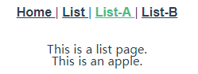
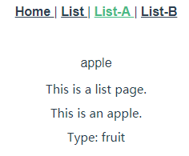

# 实例

> 2019.07.04 @wsl

## 1. Vue Router入门

安装：

vue-router是一个插件包，所以我们还是需要用npm来进行安装的。

npm install vue-router --save-dev

**router/index.js文件**

```javascript
import Vue from 'vue';   //引入Vue
import Router from 'vue-router';  //引入vue-router
import Hello from '@/components/Hello';  //引入根目录下的Hello.vue组件
 
Vue.use(Router)  //Vue全局使用Router
 
export default new Router({
  routes: [              //配置路由，这里是个数组
    {                    //每一个链接都是一个对象
      path: '/',         //链接路径
      name: 'Hello',     //路由名称，
      component: Hello   //对应的组件模板
    },
  ]
})
```

**增加路由**

```javascript
import Vue from 'vue';
import Router from 'vue-router';
import Hello from '@/components/Hello';
import List from '@/components/List';    // 引入List组件
 
Vue.use(Router);
 
export default new Router({
  routes: [
    {
      path: '/',
      name: 'Hello',
      component: Hello,
    },
    {                                   // 增加路由配置
      path: '/list',
      name: 'List',
      component: List,
    },
  ]
})
```

**router-link 制作导航**

```html
<router-link to="/link">[显示字段]</router-link>
```

to: 导航路径，index.js里的path值。

## 2. vue-router 配置子路由

改写母模板List：

```vue
<template>
    <div class="list">
        This is a list page.
        <router-view class="list-router" />
    </div>
</template>

<script>
export default {
    name: 'List',
};
</script>
```

编写子路由组件Apple, Banana：

```vue
<template>
    <div class="apple">
        {{ msg }}
    </div>
</template>

<script>
export default {
    name: 'Apple',
    data() {
        return {
            msg: 'This is an apple.',
        };
    },
};
</script>
```

```vue
<template>
    <div class="banana">
        {{ msg }}
    </div>
</template>

<script>
export default {
    name: 'Banana',
    data() {
        return {
            msg: 'This is an banana.',
        };
    },
};
</script>
```

​	在router.js里面引入子路由：

```javascript
{
    path: '/list',
    name: 'List',
    component: List,
    children: [
        { path: '/', component: List },
        { path: 'apple', component: Apple },
        { path: 'banana', component: Banana },
    ],
},
```

App.vue内写路由导航：

```vue
<template>
    <div id="app">
        <div id="nav">
            <router-link to="/">
                Home
            </router-link> |
            <router-link to="/list">
                List
            </router-link> |
            <router-link to="/list/apple">
                List-A
            </router-link> |
            <router-link to="/list/banana">
                List-B
            </router-link>
        </div>
        <router-view />
    </div>
</template>
```

效果：



## 3. vue-router 如何参数传递

### 1) 用name传递参数

a. 在路由文件 router.js 里配置 name 属性。

```javascript
{
    path: '/list',
    name: 'list',
    component: List,
    children: [
        { path: '/', name: 'list', component: List },
        { path: 'apple', name: 'apple', component: Apple },
        { path: 'banana', name: 'banana', component: Banana },
    ],
},
```

b. 模板里 App.vue 用 `$route.name` 的形式接收。

```vue
<template>
    <div id="app">
        <div id="nav">
            <router-link to="/">
                Home
            </router-link> |
            <router-link to="/list">
                List
            </router-link> |
            <router-link to="/list/apple">
                List-A
            </router-link> |
            <router-link to="/list/banana">
                List-B
            </router-link>
        </div>
        <p>{{ $route.name }}</p>
        <router-view />
    </div>
</template>
```

效果：


### 2) 通过\<router-link\> 标签中的to传参

**语法：**

```vue
<router-link :to="{name:xxx,params:{key:value}}">valueString</router-link>
```

这里的to前边是带冒号的，然后后边跟的是一个对象形式的字符串。

- `name`：就是我们在路由配置文件中起的name值。
- `params`：就是我们要传的参数，它也是对象形式，在对象里可以传递多个值。


a. 改造router-link，name为router.js中配置路由的name：

```vue
<router-link
	:to="{name: 'apple', params: {cate: 'fruit'}}"
>
	List-A
</router-link>
```

b. 在路由对应模板里，可以使用传进的参数。$route.params.cate

```vue
<template>
    <div class="apple">
        <p>{{ msg }}</p>
        <p>Type: {{ $route.params.cate }}</p>
    </div>
</template>
```

效果：



## 4. 单页面多路由区域操作

在一个页面里面有两个以上`<router-view>`区域，通过配置路由的js文件，来操作这些区域的内容。

在App.vue里面建立多个路由区域，命名为 left, right，默认 default，通过 router-link 配置路由链接：

```vue
<template>
    <div id="app">
		<div id="nav">
            <router-link to="/apple">
                Apple
            </router-link> |
            <router-link to="/banana">
                Banana
            </router-link>
        </div>
        <router-view />
        <router-view
            name="left"
            style="float:left;width:50%;background-color:#ccc;height:200px;"
        />
        <router-view
            name="right"
            style="float:right;width:50%;background-color:#c0c;height:200px;"
        />
    </div>
</template>
```

在 router.js里面配置这三个区域，在 components 字段中：

```javascript
{
    path: '/apple',
    components: {
        default: List,
        left: Apple,
        right: Banana,
    },
},
{
    path: '/banana',
    components: {
        default: List,
        left: Banana,
        right: Apple,
    },
},
```

效果：


## 5. vue-router 利用url传递参数

 **:冒号的形式传递参数**

a. 在路由配置文件中，以:冒号的形式传递参数，这就是对参数的绑定。

```javascript
{
    path: '/news/:newsId/:newsTitle',
    component: News,
},
```

b. News组件

```vue
<template>
    <div class="news">
        <p>{{ $route.params.newsId }}</p>
        <p>{{ $route.params.newsTitle }}</p>
    </div>
</template>

<script>
export default {
    name: 'News',
};
</script>
```

c. 通过url传参

```vue
<router-link to="/news/n001/Who are you">
	news01
</router-link>
```

效果：


**正则表达式在URL传值中的应用**

vue的url传参，支持正则表达式，以圆括号形式写入即可。

```javascript
path:'/params/:newsId(\\d+)/:newsTitle',
```

该正则限制了新闻ID只能是数字的形式，加入了正则，我们再传递数字之外的其他参数，News组件就没有办法接收到。

## 6. vue-router 的重定向 redirect

开发中有时候我们虽然设置的路径不一致，但是我们希望跳转到同一个页面，或者说是打开同一个组件。这时候我们就用到了路由的重新定向redirect参数。

**redirect基本重定向**

只要在路由配置文件中把原来的component换成redirect参数就可以了。

```javascript
{
    path: '/listv2',
    redirect: '/apple',
},
```

**重定向时传递参数**

重定向时如果也需要传递参数怎么办？其实vue也已经为我们设置好了，我们只需要在ridirect后边的参数里复制重定向路径的path参数就可以了。

```javascript
{
    path: '/news/:newsId(\\d+)/:newsTitle',
    component: News,
},
{
    path: '/gonews/:newsId(\\d+)/:newsTitle',
    redirect: '/news/:newsId(\\d+)/:newsTitle',
}
```

## 7. alias 别名的使用

使用alias别名的形式，也可以实现类似重定向的效果。

a. 在路由配置文件里，为路径起一个别名

```javascript
{
    path: '/',
    name: 'home',
    component: Home,
    alias: '/home',
},
```

b. 起过别名之后，可以直接使用`<router-link>`标签里的to属性，进行重新定向。

```vue
<router-link to="/home">
	home
</router-link>
```

**redirect和alias的区别**

- redirect：仔细观察URL，redirect是直接改变了url的值，把url变成了真实的path路径。
- alias：URL路径没有别改变，这种情况更友好，让用户知道自己访问的路径，只是改变了`<router-view>`中的内容。

## 8. 路由的过渡动画

`<transition>`标签

a. 想让路由有过渡动画，需要在`<router-view>`标签的外部添加`<transition>`标签，标签还需要一个`name`属性。

```vue
<transition name="fade">
	<router-view />
</transition>
```

**css过渡类名：** 组件过渡过程中，会有四个CSS类名进行切换，这四个类名与transition的name属性有关，比如name=”fade”,会有如下四个CSS类名：

- fade-enter:进入过渡的开始状态，元素被插入时生效，只应用一帧后立刻删除。
- fade-enter-active:进入过渡的结束状态，元素被插入时就生效，在过渡过程完成后移除。
- fade-leave:离开过渡的开始状态，元素被删除时触发，只应用一帧后立刻删除。
- fade-leave-active:离开过渡的结束状态，元素被删除时生效，离开过渡完成后被删除。

b. 设置css样式

```css
.fade-enter {
    opacity: 0;
}

.fade-leave{
    opacity: 1;
}

.fade-enter-active{
    transition: opacity .5s;
}

.fade-leave-active{
	opacity: 0;
    transition: opacity .5s;
}
```

**过渡模式mode：**

- `in-out`：新元素先进入过渡，完成之后当前元素过渡离开。
- `out-in`：当前元素先进行过渡离开，离开完成后新元素过渡进入。

## 9. mode的设置和404页面的处理

**mode的两个值**

路由有一个mode属性。

- `histroy`:当你使用 `history` 模式时，URL 就像正常的 url，例如 `http://jsapng.com/lms/`，也好看！

- `hash`:默认’hash’值，但是hash看起来就像无意义的字符排列，不太好看也不符合我们一般的网址浏览习惯。


