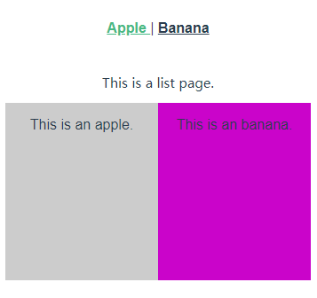

# 实例

> 2019.07.04 @wsl

## 1. Vue-router入门

安装：

vue-router是一个插件包，所以我们还是需要用npm来进行安装的。

npm install vue-router --save-dev

**router/index.js文件**

```javascript
import Vue from 'vue';   //引入Vue
import Router from 'vue-router';  //引入vue-router
import Hello from '@/components/Hello';  //引入根目录下的Hello.vue组件
 
Vue.use(Router)  //Vue全局使用Router
 
export default new Router({
  routes: [              //配置路由，这里是个数组
    {                    //每一个链接都是一个对象
      path: '/',         //链接路径
      name: 'Hello',     //路由名称，
      component: Hello   //对应的组件模板
    },
  ]
})
```

**增加路由**

```javascript
import Vue from 'vue';
import Router from 'vue-router';
import Hello from '@/components/Hello';
import List from '@/components/List';    // 引入List组件
 
Vue.use(Router);
 
export default new Router({
  routes: [
    {
      path: '/',
      name: 'Hello',
      component: Hello,
    },
    {                                   // 增加路由配置
      path: '/list',
      name: 'List',
      component: List,
    },
  ]
})
```

**router-link 制作导航**

```html
<router-link to="/link">[显示字段]</router-link>
```

to: 导航路径，index.js里的path值。

## 2. vue-router 配置子路由

改写母模板List：

```vue
<template>
    <div class="list">
        This is a list page.
        <router-view class="list-router" />
    </div>
</template>

<script>
export default {
    name: 'List',
};
</script>
```

编写子路由组件Apple, Banana：

```vue
<template>
    <div class="apple">
        {{ msg }}
    </div>
</template>

<script>
export default {
    name: 'Apple',
    data() {
        return {
            msg: 'This is an apple.',
        };
    },
};
</script>
```

```vue
<template>
    <div class="banana">
        {{ msg }}
    </div>
</template>

<script>
export default {
    name: 'Banana',
    data() {
        return {
            msg: 'This is an banana.',
        };
    },
};
</script>
```

​	在router.js里面引入子路由：

```javascript
{
    path: '/list',
    name: 'List',
    component: List,
    children: [
        { path: '/', component: List },
        { path: 'apple', component: Apple },
        { path: 'banana', component: Banana },
    ],
},
```

App.vue内写路由导航：

```vue
<template>
    <div id="app">
        <div id="nav">
            <router-link to="/">
                Home
            </router-link> |
            <router-link to="/list">
                List
            </router-link> |
            <router-link to="/list/apple">
                List-A
            </router-link> |
            <router-link to="/list/banana">
                List-B
            </router-link>
        </div>
        <router-view />
    </div>
</template>
```

效果：


## 3. Vue-router 如何参数传递

### 1) 用name传递参数

a. 在路由文件 router.js 里配置 name 属性。

```javascript
{
    path: '/list',
    name: 'list',
    component: List,
    children: [
        { path: '/', name: 'list', component: List },
        { path: 'apple', name: 'apple', component: Apple },
        { path: 'banana', name: 'banana', component: Banana },
    ],
},
```

b. 模板里 App.vue 用 `$route.name` 的形式接收。

```vue
<template>
    <div id="app">
        <div id="nav">
            <router-link to="/">
                Home
            </router-link> |
            <router-link to="/list">
                List
            </router-link> |
            <router-link to="/list/apple">
                List-A
            </router-link> |
            <router-link to="/list/banana">
                List-B
            </router-link>
        </div>
        <p>{{ $route.name }}</p>
        <router-view />
    </div>
</template>
```

效果：


### 2) 通过\<router-link\> 标签中的to传参

**语法：**

```vue
<router-link :to="{name:xxx,params:{key:value}}">valueString</router-link>
```

这里的to前边是带冒号的，然后后边跟的是一个对象形式的字符串。

- `name`：就是我们在路由配置文件中起的name值。
- `params`：就是我们要传的参数，它也是对象形式，在对象里可以传递多个值。


a. 改造router-link，name为router.js中配置路由的name：

```vue
<router-link
	:to="{name: 'apple', params: {cate: 'fruit'}}"
>
	List-A
</router-link>
```

b. 在路由对应模板里，可以使用传进的参数。$route.params.cate

```vue
<template>
    <div class="apple">
        <p>{{ msg }}</p>
        <p>Type: {{ $route.params.cate }}</p>
    </div>
</template>
```

效果：


## 4. 单页面多路由区域操作

在一个页面里面有两个以上`<router-view>`区域，通过配置路由的js文件，来操作这些区域的内容。

在App.vue里面建立多个路由区域，命名为 left, right，默认 default，通过 router-link 配置路由链接：

```vue
<template>
    <div id="app">
		<div id="nav">
            <router-link to="/apple">
                Apple
            </router-link> |
            <router-link to="/banana">
                Banana
            </router-link>
        </div>
        <router-view />
        <router-view
            name="left"
            style="float:left;width:50%;background-color:#ccc;height:200px;"
        />
        <router-view
            name="right"
            style="float:right;width:50%;background-color:#c0c;height:200px;"
        />
    </div>
</template>
```

在 router.js里面配置这三个区域，在 components 字段中：

```javascript
{
    path: '/apple',
    components: {
        default: List,
        left: Apple,
        right: Banana,
    },
},
{
    path: '/banana',
    components: {
        default: List,
        left: Banana,
        right: Apple,
    },
},
```

效果：




